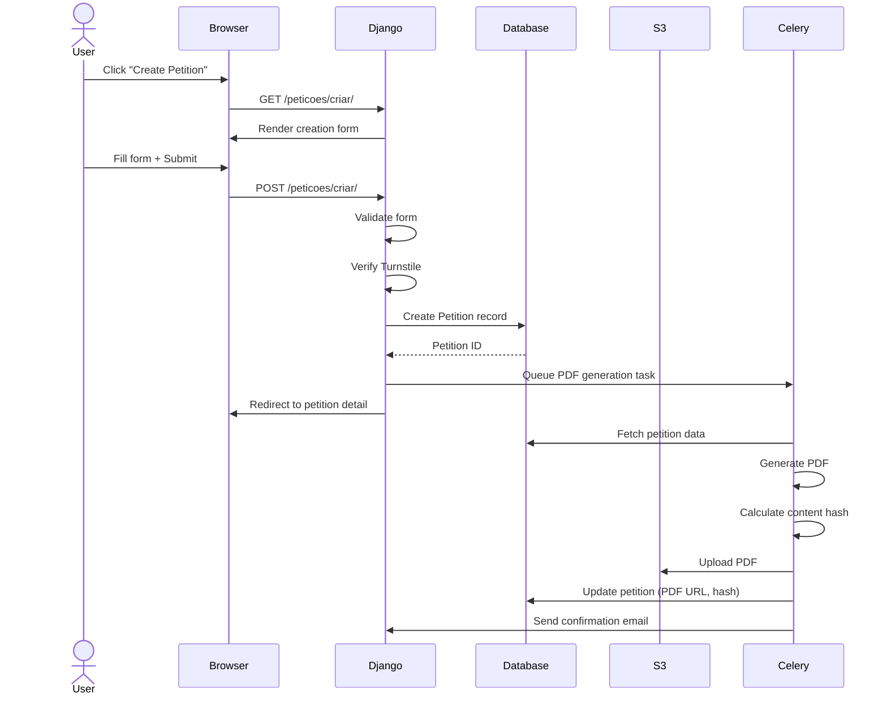
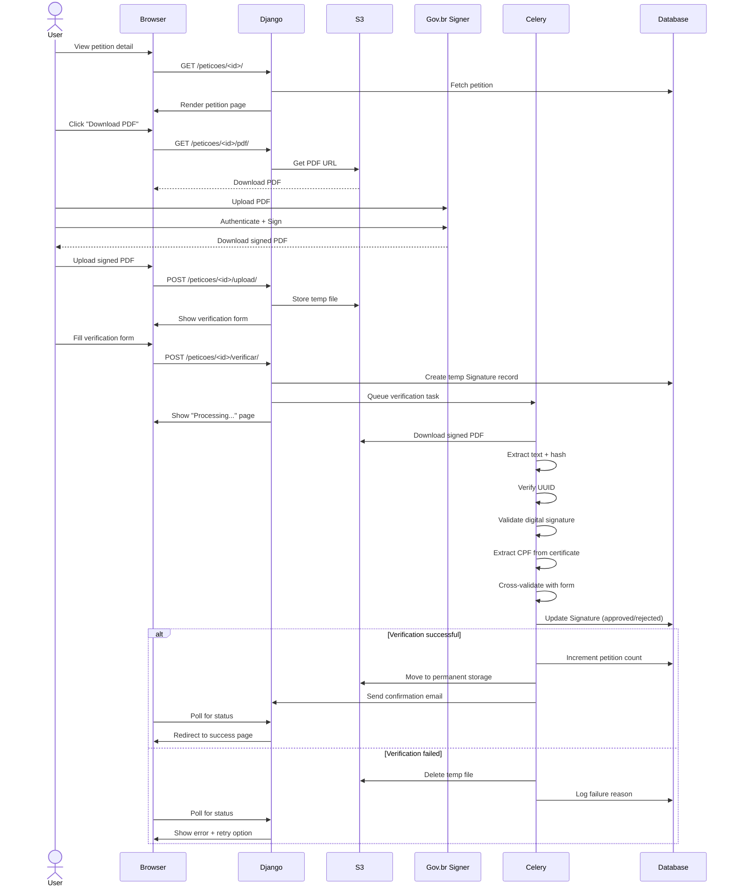
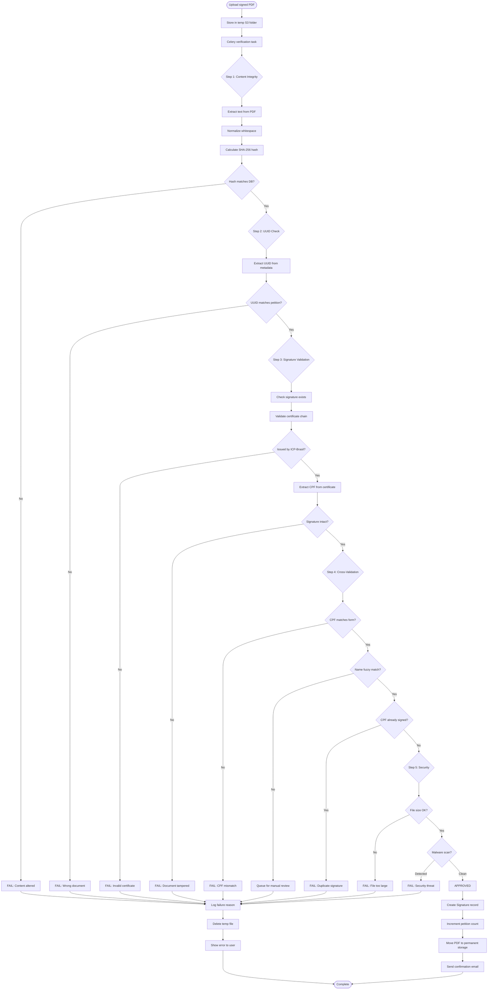

# Democracia Direta - Requirements and Architecture

**Project Phase:** Planning - Phase 1  
**Document Version:** 1.0  
**Last Updated:** November 23, 2025  
**Status:** Draft

---

## Table of Contents

1. [Functional Requirements](#functional-requirements)
2. [Non-Functional Requirements](#non-functional-requirements)
3. [System Architecture](#system-architecture)
4. [Technology Stack](#technology-stack)
5. [URL Structure](#url-structure)
6. [Third-Party Integrations](#third-party-integrations)
7. [Data Flow Diagrams](#data-flow-diagrams)

---

## Functional Requirements

### FR1: Petition Management

#### FR1.1: Create Petition (Authenticated Users)
**Priority:** P0 (Must Have)

- **Actor:** Registered User
- **Preconditions:** User must be logged in
- **Description:** Allow users to create new public petitions

**Acceptance Criteria:**
- [ ] User can access "Create Petition" page from navigation menu
- [ ] Form includes required fields:
  - Title (max 200 characters)
  - Description (rich text, max 10,000 characters)
  - Category (dropdown selection)
  - Signature goal (numeric, min 10, max 1,000,000)
  - Deadline (optional date, min 7 days from creation, max 1 year)
- [ ] Form validates all inputs before submission
- [ ] Turnstile CAPTCHA required before submission
- [ ] System generates unique UUID for petition
- [ ] System generates PDF automatically upon creation
- [ ] Petition is published immediately (or queued for moderation)
- [ ] Creator receives confirmation email with petition URL

**Technical Notes:**
- Implement Turnstile CAPTCHA middleware for petition creation
- PDF generation should be async (Celery task) to avoid blocking
- Store creator as ForeignKey to Django User model

---

#### FR1.2: View Petition List
**Priority:** P0 (Must Have)

- **Actor:** Any Visitor (no authentication required)
- **Description:** Browse and search active petitions

**Acceptance Criteria:**
- [ ] Public page displays all active petitions
- [ ] Each petition card shows:
  - Title
  - Category badge
  - Current signature count vs goal (progress bar)
  - Days remaining (if deadline set)
  - Creator username (or "Anonymous" if privacy enabled)
  - Creation date
- [ ] Pagination (20 petitions per page)
- [ ] Filter options:
  - By category
  - By status (active/completed/expired)
  - By signature count (ascending/descending)
- [ ] Search by title/description (full-text search)
- [ ] Sort options:
  - Most recent
  - Most signatures
  - Closest to goal
  - Expiring soon

**Technical Notes:**
- Use Django's `Paginator` class
- Implement search using PostgreSQL full-text search
- Cache petition counts (update every 5 minutes)

---

#### FR1.3: View Petition Detail
**Priority:** P0 (Must Have)

- **Actor:** Any Visitor
- **Description:** View complete petition information and take action

**Acceptance Criteria:**
- [ ] Display full petition content:
  - Title
  - Full description (formatted HTML)
  - Category
  - Signature progress (count/goal + percentage)
  - Visual progress bar
  - Creator information
  - Creation and deadline dates
  - Status badge (active/completed/expired)
- [ ] Prominent "Sign This Petition" button (if active)
- [ ] Share buttons (WhatsApp, Twitter, Facebook, Email, Copy Link)
- [ ] Recent signers list (optional, based on privacy settings)
  - Show last 10 signers
  - Display: Name (or initials), City/State, Time ago
- [ ] Download original petition PDF button
- [ ] Creator can see "Manage Petition" button (if logged in as creator)

**Technical Notes:**
- Lazy load recent signers (AJAX)
- Implement OpenGraph meta tags for social sharing
- Generate share text dynamically

---

#### FR1.4: Manage Petition (Creator Only)
**Priority:** P1 (Should Have)

- **Actor:** Petition Creator
- **Preconditions:** User is authenticated and is the petition creator
- **Description:** View analytics and manage petition settings

**Acceptance Criteria:**
- [ ] Dashboard shows:
  - Total signature count
  - Daily signature trend (chart - last 30 days)
  - Completion percentage
  - Estimated days to goal (if trending)
  - Top cities/states of signers
- [ ] Actions available:
  - Download complete petition bundle (all signatures)
  - Export signer list (CSV)
  - Close petition early (with confirmation)
  - Edit description (minor corrections only, with audit log)
- [ ] Email notification settings:
  - Notify on signature milestones (10%, 25%, 50%, 75%, 90%, 100%)
  - Daily digest of new signatures
  - Weekly summary

**Technical Notes:**
- Use Chart.js for trend visualization
- Implement rate limiting on export/download (max 5 per hour)
- Audit log for any petition edits

---

### FR2: Signature Process

#### FR2.1: Download Petition PDF
**Priority:** P0 (Must Have)

- **Actor:** Any Visitor
- **Description:** Download unsigned petition PDF for signing

**Acceptance Criteria:**
- [ ] Button labeled "Download Petition to Sign"
- [ ] Clicking button immediately downloads PDF
- [ ] PDF includes:
  - Petition UUID (visible in header/footer)
  - Petition title
  - Full description
  - Category
  - Signature goal
  - Creation date
  - Creator name
  - Platform branding (Pressiona logo)
  - Instructions: "Sign this document using Gov.br"
  - Signature placeholder area
- [ ] PDF metadata contains:
  - UUID
  - Petition ID
  - Content hash (SHA-256)
  - Generation timestamp
- [ ] File name format: `petição-{petition-id}-{uuid-short}.pdf`
- [ ] Download tracking (analytics only, no user identification)

**Technical Notes:**
- Generate PDF on-the-fly or cache first generation
- Use ReportLab for PDF generation
- Ensure PDF is Gov.br signature compatible
- File size should be <500KB

---

#### FR2.2: Signing Instructions
**Priority:** P0 (Must Have)

- **Actor:** Any Visitor
- **Description:** Provide clear step-by-step instructions for Gov.br signing

**Acceptance Criteria:**
- [ ] Dedicated instructions page linked from petition detail
- [ ] Step-by-step guide with screenshots:
  1. Download the petition PDF
  2. Go to Gov.br signature system (link provided)
  3. Log in with Gov.br credentials
  4. Upload the petition PDF
  5. Select signature type (must be "Advanced" or "Qualified")
  6. Complete signature process
  7. Download signed PDF
  8. Return to Pressiona and upload
- [ ] Video tutorial (embedded YouTube - can be added later)
- [ ] FAQ section:
  - "I don't have a Gov.br account"
  - "What signature level do I need?"
  - "Can I sign on mobile?"
  - "Is my data secure?"
- [ ] Direct link to Gov.br signature page: https://signer.estaleiro.serpro.gov.br/
- [ ] Troubleshooting guide

**Technical Notes:**
- Create reusable template component
- Update instructions if Gov.br changes their process
- Track which step users abandon (analytics)

---

#### FR2.3: Upload Signed PDF
**Priority:** P0 (Must Have)

- **Actor:** Any Visitor (Signer)
- **Description:** Upload Gov.br signed petition PDF

**Acceptance Criteria:**
- [ ] Upload form on petition detail page
- [ ] File upload field with drag-and-drop support
- [ ] Validation before upload:
  - File type must be PDF
  - File size max 10MB
  - File name check (basic)
- [ ] Upload progress indicator
- [ ] Immediate file processing:
  - Virus scan (if ClamAV enabled)
  - File type verification (magic bytes)
  - Size check
- [ ] Upon successful upload, redirect to verification form
- [ ] Error messages:
  - "File is not a valid PDF"
  - "File is too large"
  - "File appears to be corrupted"
  - "Security scan detected an issue"

**Technical Notes:**
- Use Django's `FileField` with custom validators
- Store uploaded files temporarily (delete after verification)
- Implement async processing (Celery) for large files
- Sanitize filename to prevent path traversal attacks

---

#### FR2.4: Verification Form
**Priority:** P0 (Must Have)

- **Actor:** Any Visitor (Signer)
- **Description:** Collect signer information for verification

**Acceptance Criteria:**
- [ ] Form appears after successful PDF upload
- [ ] Required fields:
  - Full name (as appears in CPF)
  - CPF (formatted: 000.000.000-00)
  - Email (for confirmation)
  - City (autocomplete)
  - State (dropdown)
- [ ] Optional fields:
  - Allow name to appear publicly (checkbox, default: initials only)
  - Receive updates about this petition (checkbox)
- [ ] CPF validation:
  - Format check
  - Valid CPF algorithm check
  - Not already used for this petition
- [ ] Email validation:
  - Format check
  - Optionally: verify email exists (MX record)
- [ ] CAPTCHA (Turnstile) required
- [ ] Privacy policy consent checkbox (required)
- [ ] Submit button: "Verify My Signature"

**Technical Notes:**
- Use `validate-cpf` library or implement CPF validator
- Real-time validation feedback (AJAX)
- Store form data temporarily until verification completes
- Clear error messages for each field

---

#### FR2.5: Signature Verification (Automated)
**Priority:** P0 (Must Have)

- **Actor:** System (Background Process)
- **Description:** Automatically verify uploaded signed PDF

**Acceptance Criteria:**
- [ ] Multi-step verification process:
  
  **Step 1: Content Integrity (Text Comparison Between Documents)**
  - Extract text content from the **original petition PDF** (generated by system)
  - Extract text content from the **signed PDF** (uploaded by user)
  - Normalize both texts (remove extra whitespace, formatting)
  - **Directly compare the two text strings** - must be identical
  - Additionally calculate SHA-256 hash of signed PDF text
  - Compare with stored content hash
  - This ensures document text was not altered between download and signing
  - Result: PASS/FAIL
  
  **Step 2: Petition Identification**
  - Extract UUID from PDF metadata
  - Extract UUID from PDF visible text
  - Match against database
  - Result: PASS/FAIL
  
  **Step 3: Digital Signature Validation**
  - Check PDF has digital signature
  - Validate signature certificate chain
  - Verify signature is from Gov.br CA
  - Extract signer CPF from certificate
  - Check signature hasn't been tampered with
  - Result: PASS/FAIL + extracted CPF
  
  **Step 4: Cross-Validation**
  - Compare extracted CPF with form CPF
  - Compare extracted name with form name (fuzzy match 90%+)
  - Check CPF not already in signatures table for this petition
  - Result: PASS/FAIL
  
  **Step 5: Security Checks**
  - Verify file size reasonable (<10MB)
  - Check for embedded malicious content
  - Validate PDF structure integrity
  - Result: PASS/FAIL

- [ ] Overall verification result:
  - **APPROVED:** All steps pass → Create signature record
  - **REJECTED:** Any critical step fails → Show specific error
  - **MANUAL_REVIEW:** Non-critical issues → Queue for admin review

- [ ] Success actions:
  - Create Signature record in database
  - Increment petition signature count
  - Send confirmation email to signer
  - Store signed PDF permanently
  - Delete temporary upload file
  - Show success page to user

- [ ] Failure actions:
  - Log failure reason and step
  - Show user-friendly error message
  - Allow retry with different file
  - Notify admins if fraud suspected
  - Delete uploaded file

**Technical Notes:**
- Implement as async Celery task (can take 10-30 seconds)
- Use `pyHanko` or `endesive` for signature validation
- Use `pdfplumber` for text extraction
- Implement retry logic (max 3 attempts)
- Comprehensive logging for debugging

---

### FR3: Search and Discovery

#### FR3.1: Full-Text Search
**Priority:** P1 (Should Have)

- **Actor:** Any Visitor
- **Description:** Search petitions by keywords

**Acceptance Criteria:**
- [ ] Search bar on petition list page
- [ ] Search box in header (global search)
- [ ] Search across:
  - Petition title (highest weight)
  - Petition description
  - Category name
- [ ] Results ranked by relevance
- [ ] Highlight matching keywords in results
- [ ] Show result count
- [ ] No results message with suggestions

**Technical Notes:**
- Use PostgreSQL `SearchVector` and `SearchQuery`
- Create database index on search fields
- Implement debouncing on search input (300ms)

---

#### FR3.2: Category Browsing
**Priority:** P1 (Should Have)

- **Actor:** Any Visitor
- **Description:** Browse petitions by category

**Acceptance Criteria:**
- [ ] Category page showing all categories
- [ ] Each category shows:
  - Name
  - Icon
  - Active petition count
  - Total signatures collected
- [ ] Clicking category filters petition list
- [ ] Breadcrumb navigation
- [ ] SEO-friendly URLs: `/peticoes/categoria/saude/`

**Technical Notes:**
- Predefined categories (database fixtures)
- Use Django slugs for URLs
- Cache category counts

---

### FR4: Moderation and Admin

#### FR4.1: Admin Dashboard
**Priority:** P1 (Should Have)

- **Actor:** Platform Administrator
- **Description:** Django admin interface for petition management

**Acceptance Criteria:**
- [ ] Custom admin views for:
  - Petition list with filters (status, category, date)
  - Signature list with filters (petition, verification status, date)
  - Flagged content queue
- [ ] Admin actions:
  - Approve/reject petition
  - Mark petition as inappropriate (hide)
  - Manually verify signature
  - Reject signature
  - Export data (CSV/JSON)
- [ ] Search capabilities across all models
- [ ] Inline signature viewing from petition admin

**Technical Notes:**
- Extend Django admin with custom views
- Use `django-admin-list-filter-dropdown` for better UX
- Implement admin action logging

---

#### FR4.2: Content Reporting
**Priority:** P2 (Nice to Have)

- **Actor:** Any Visitor
- **Description:** Report inappropriate petitions

**Acceptance Criteria:**
- [ ] "Report" button on petition detail page
- [ ] Report form with reason selection:
  - Spam
  - Hate speech
  - Misinformation
  - Off-topic
  - Duplicate
  - Other (text field)
- [ ] Optional: Reporter email for follow-up
- [ ] CAPTCHA required
- [ ] Creates flagged content record
- [ ] Admins notified via email
- [ ] Reporter sees confirmation message

**Technical Notes:**
- Rate limit: max 5 reports per IP per day
- Store reporter IP (hashed) for abuse prevention
- Auto-hide petition if receives 10+ reports (pending review)

---

## Non-Functional Requirements

### NFR1: Performance

| Metric | Target | Measurement |
|--------|--------|-------------|
| Petition list page load | <2 seconds | Google PageSpeed |
| Petition detail page load | <1.5 seconds | Google PageSpeed |
| PDF generation | <5 seconds | Custom monitoring |
| PDF verification | <30 seconds | Custom monitoring |
| Search response time | <1 second | Custom monitoring |
| Concurrent users | 1,000+ | Load testing |

**Implementation:**
- Database query optimization (select_related, prefetch_related)
- Redis caching for frequently accessed data
- CDN for static files and PDF downloads
- Async processing for heavy tasks (PDF gen, verification)
- Database indexing on frequently queried fields

---

### NFR2: Security

#### Data Protection
- [ ] All file uploads scanned for malware
- [ ] PDF sanitization before storage
- [ ] SQL injection prevention (Django ORM)
- [ ] XSS prevention (Django templates auto-escape)
- [ ] CSRF protection on all forms
- [ ] Rate limiting on sensitive endpoints
- [ ] HTTPS only (redirect HTTP)

#### LGPD Compliance
- [ ] Privacy policy updated to include petition features
- [ ] User consent for data collection (verification form)
- [ ] Right to be forgotten (delete signature)
- [ ] Data minimization (only collect necessary info)
- [ ] Data retention policy (delete old petitions after 2 years)
- [ ] Secure storage of CPF (encrypted at rest)
- [ ] Access logs for audit trail

#### Authentication & Authorization
- [ ] Petition creation requires authentication
- [ ] Only creators can manage their petitions
- [ ] Only admins can access moderation tools
- [ ] Session timeout: 2 weeks
- [ ] Password requirements enforced

**Implementation:**
- Use Django's security middleware
- Implement `django-ratelimit` for API endpoints
- Use `django-defender` for brute force protection
- Encrypt sensitive fields with `django-fernet-fields`
- Regular security audits and dependency updates

---

### NFR3: Scalability

**Current State (MVP):**
- Single Heroku dyno
- PostgreSQL database
- Local file storage or S3

**Future Scaling Path:**
- Horizontal scaling (multiple dynos)
- Read replicas for database
- Redis for caching and sessions
- CDN for file delivery
- Message queue for async tasks (Redis/RabbitMQ)

**Capacity Planning:**
- 100 petitions/month
- 1,000 signatures/month
- 10,000 visitors/month
- 10GB file storage/month

---

### NFR4: Accessibility

**WCAG 2.1 Level AA Compliance:**
- [ ] Semantic HTML structure
- [ ] Proper heading hierarchy (h1-h6)
- [ ] Alt text for all images
- [ ] ARIA labels for interactive elements
- [ ] Keyboard navigation support
- [ ] Focus indicators visible
- [ ] Color contrast ratio ≥ 4.5:1
- [ ] Form labels properly associated
- [ ] Error messages clear and associated with fields
- [ ] Skip to main content link

**Implementation:**
- Use `django-accessibility` package
- Test with screen readers (NVDA, JAWS)
- Automated testing with `axe-core`

---

### NFR5: SEO Optimization

**On-Page SEO:**
- [ ] Unique title tags per page
- [ ] Meta descriptions (max 160 chars)
- [ ] Canonical URLs
- [ ] OpenGraph tags for social sharing
- [ ] Twitter Card markup
- [ ] Schema.org structured data (Petition schema)
- [ ] Sitemap.xml includes petition pages
- [ ] robots.txt properly configured

**Technical SEO:**
- [ ] Mobile-friendly (responsive design)
- [ ] Fast page load (<3s)
- [ ] HTTPS enabled
- [ ] Clean URL structure
- [ ] 404 page with helpful links
- [ ] Proper HTTP status codes

**Implementation:**
- Create custom sitemap in `petitions/sitemaps.py`
- Use `django-meta` for meta tag management
- Implement JSON-LD structured data for petitions
- Generate `sitemap.xml` and `robots.txt`

---

### NFR6: Monitoring and Logging

**Application Monitoring:**
- [ ] Error tracking (Sentry or similar)
- [ ] Performance monitoring (New Relic or similar)
- [ ] Uptime monitoring (UptimeRobot)
- [ ] Custom metrics:
  - Petitions created/day
  - Signatures collected/day
  - Verification success rate
  - Average verification time
  - Top failure reasons

**Logging:**
- [ ] Application logs (INFO level production)
- [ ] Error logs (ERROR level)
- [ ] Audit logs (petition edits, admin actions)
- [ ] Security logs (failed logins, suspicious activity)
- [ ] Log retention: 90 days

**Implementation:**
- Use Python `logging` module
- Centralized logging (Papertrail or similar)
- Log aggregation and search
- Alerting on critical errors

---

## System Architecture

### High-Level Architecture

```
┌─────────────────────────────────────────────────────────────┐
│                         Users / Browsers                     │
└────────────┬────────────────────────────────────────────────┘
             │
             │ HTTPS
             ▼
┌─────────────────────────────────────────────────────────────┐
│                     Cloudflare CDN (optional)                │
│                   - Static files caching                     │
│                   - DDoS protection                          │
└────────────┬────────────────────────────────────────────────┘
             │
             ▼
┌─────────────────────────────────────────────────────────────┐
│                        Heroku Platform                       │
│  ┌───────────────────────────────────────────────────────┐  │
│  │              Web Dyno (Django Application)            │  │
│  │  ┌─────────────────────────────────────────────────┐  │  │
│  │  │  democracia_direta_project/                     │  │  │
│  │  │    ├── settings.py                              │  │  │
│  │  │    ├── urls.py (main router)                    │  │  │
│  │  │    └── wsgi.py                                  │  │  │
│  │  │                                                  │  │  │
│  │  │  petitions/ (main app)                          │  │  │
│  │  │    ├── models.py                                │  │  │
│  │  │    │     ├── Petition                           │  │  │
│  │  │    │     ├── Signature                          │  │  │
│  │  │    │     ├── Category                           │  │  │
│  │  │    │     └── FlaggedContent                     │  │  │
│  │  │    ├── views.py                                 │  │  │
│  │  │    │     ├── PetitionListView                   │  │  │
│  │  │    │     ├── PetitionDetailView                 │  │  │
│  │  │    │     ├── PetitionCreateView                 │  │  │
│  │  │    │     ├── SignPetitionView                   │  │  │
│  │  │    │     └── VerifySignatureView                │  │  │
│  │  │    ├── urls.py                                  │  │  │
│  │  │    ├── forms.py                                 │  │  │
│  │  │    ├── admin.py                                 │  │  │
│  │  │    ├── tasks.py (Celery tasks)                  │  │  │
│  │  │    │     ├── generate_petition_pdf()            │  │  │
│  │  │    │     └── verify_signature_pdf()             │  │  │
│  │  │    ├── services/                                │  │  │
│  │  │    │     ├── pdf_generator.py                   │  │  │
│  │  │    │     ├── pdf_validator.py                   │  │  │
│  │  │    │     └── signature_verifier.py              │  │  │
│  │  │    ├── utils/                                   │  │  │
│  │  │    │     ├── validators.py (CPF, etc.)          │  │  │
│  │  │    │     └── helpers.py                         │  │  │
│  │  │    └── middleware/                              │  │  │
│  │  │          └── turnstile.py (CAPTCHA)             │  │  │
│  │  └─────────────────────────────────────────────────┘  │  │
│  └───────────────────────────────────────────────────────┘  │
│                                                             │
│  ┌───────────────────────────────────────────────────────┐  │
│  │         Worker Dyno (Celery - optional for MVP)      │  │
│  │              - PDF generation tasks                  │  │
│  │              - Signature verification tasks          │  │
│  └───────────────────────────────────────────────────────┘  │
│                                                             │
│  ┌───────────────────────────────────────────────────────┐  │
│  │           PostgreSQL Database (Heroku Addon)         │  │
│  │              - All application data                  │  │
│  │              - Petition, Signature tables            │  │
│  └───────────────────────────────────────────────────────┘  │
│                                                             │
│  ┌───────────────────────────────────────────────────────┐  │
│  │         Redis (Heroku Addon - optional for MVP)      │  │
│  │              - Caching                               │  │
│  │              - Celery message broker                 │  │
│  └───────────────────────────────────────────────────────┘  │
└─────────────────────────────────────────────────────────────┘
             │
             │
             ▼
┌─────────────────────────────────────────────────────────────┐
│                  File Storage (AWS S3 or similar)           │
│                  - Petition PDFs (unsigned)                 │
│                  - Signed PDFs                              │
│                  - Temporary upload files                   │
└─────────────────────────────────────────────────────────────┘
             │
             │
             ▼
┌─────────────────────────────────────────────────────────────┐
│                  External Services                          │
│  ┌─────────────────┐  ┌──────────────────┐                 │
│  │  Gov.br Sign    │  │  Email Service   │                 │
│  │  (user goes to) │  │  (SendGrid/SES)  │                 │
│  └─────────────────┘  └──────────────────┘                 │
└─────────────────────────────────────────────────────────────┘
```

---

### Django App Structure

```
democracia_direta_project/  # Main Django project
│
├── democracia_direta_project/  # Project configuration
│   ├── __init__.py
│   ├── settings.py
│   ├── urls.py
│   ├── wsgi.py
│   └── asgi.py
│
├── manage.py
│
└── petitions/  # Main application
│
├── __init__.py
├── apps.py                      # App configuration
├── admin.py                     # Django admin customization
├── urls.py                      # URL routing for this app
├── forms.py                     # Django forms
│     ├── PetitionCreateForm
│     ├── SignatureVerificationForm
│     └── PetitionReportForm
│
├── models.py                    # Database models
│     ├── Category
│     ├── Petition
│     ├── Signature
│     └── FlaggedContent
│
├── views.py                     # View controllers
│     ├── PetitionListView (ListView)
│     ├── PetitionDetailView (DetailView)
│     ├── PetitionCreateView (CreateView)
│     ├── PetitionManageView (DetailView + mixins)
│     ├── DownloadPetitionPDFView (View)
│     ├── SigningInstructionsView (TemplateView)
│     ├── UploadSignedPDFView (FormView)
│     ├── VerifySignatureFormView (FormView)
│     └── SignatureSuccessView (TemplateView)
│
├── tasks.py                     # Celery async tasks
│     ├── generate_petition_pdf_task()
│     ├── verify_signature_pdf_task()
│     └── send_signature_confirmation_email()
│
├── services/                    # Business logic layer
│   ├── __init__.py
│   ├── pdf_generator.py
│   │     ├── PetitionPDFGenerator
│   │     │     ├── generate()
│   │     │     ├── _create_header()
│   │     │     ├── _create_body()
│   │     │     └── _embed_metadata()
│   │     └── calculate_content_hash()
│   │
│   ├── pdf_validator.py
│   │     ├── PDFValidator
│   │     │     ├── validate_file_type()
│   │     │     ├── validate_file_size()
│   │     │     ├── extract_text_content()
│   │     │     └── extract_metadata()
│   │     └── normalize_text()
│   │
│   └── signature_verifier.py
│         ├── SignatureVerifier
│         │     ├── verify_signature()
│         │     ├── _verify_content_integrity()
│         │     ├── _verify_petition_uuid()
│         │     ├── _validate_digital_signature()
│         │     ├── _cross_validate_data()
│         │     ├── _security_checks()
│         │     └── _extract_cpf_from_certificate()
│         └── VerificationResult (dataclass)
│
├── utils/                       # Helper utilities
│   ├── __init__.py
│   ├── validators.py
│   │     ├── validate_cpf()
│   │     ├── validate_pdf_file()
│   │     └── sanitize_filename()
│   ├── helpers.py
│   │     ├── format_cpf()
│   │     ├── calculate_days_remaining()
│   │     └── generate_share_text()
│   └── constants.py
│         ├── PETITION_CATEGORIES
│         ├── SIGNATURE_STATUS_CHOICES
│         └── MAX_FILE_SIZE
│
├── templates/
│   └── democracia_direta/
│       ├── base_petition.html   # Extends pressionaapp/base.html
│       ├── petition_list.html
│       ├── petition_detail.html
│       ├── petition_create.html
│       ├── petition_manage.html
│       ├── signing_instructions.html
│       ├── upload_signed_pdf.html
│       ├── verification_form.html
│       ├── signature_success.html
│       └── components/
│           ├── petition_card.html
│           ├── progress_bar.html
│           └── share_buttons.html
│
├── static/
│   └── democracia_direta/
│       ├── css/
│       │   └── petitions.css
│       ├── js/
│       │   ├── petition-form.js
│       │   ├── file-upload.js
│       │   └── signature-tracker.js
│       └── img/
│           └── category-icons/
│
├── management/
│   └── commands/
│       ├── load_petition_categories.py
│       ├── cleanup_old_uploads.py
│       └── generate_petition_report.py
│
├── migrations/
│   ├── __init__.py
│   └── 0001_initial.py
│
└── tests/
    ├── __init__.py
    ├── test_models.py
    ├── test_views.py
    ├── test_forms.py
    ├── test_pdf_generator.py
    ├── test_signature_verifier.py
    └── fixtures/
        ├── test_petition.pdf
        └── test_signed_petition.pdf
```

---

## Technology Stack

### Backend Framework
- **Django 4.2+** (already in use)
- **Python 3.10+**
- **Django REST Framework** (optional, for future API)

### Database
- **PostgreSQL 14+** (Heroku Postgres addon)
- **psycopg2** (PostgreSQL adapter)

### PDF Processing
- **ReportLab 4.0+** - PDF generation
  - Pros: Powerful, widely used, extensive docs
  - Cons: Commercial license for some features
- **Alternative: WeasyPrint** - HTML to PDF
  - Pros: CSS-based styling, easier templates
  - Cons: Requires system dependencies (cairo)

- **pyHanko 0.20+** - PDF signature validation
  - Best library for validating digital signatures
  - Supports ICP-Brasil certificates (Gov.br)
- **pdfplumber 0.10+** - Text extraction
  - More reliable than PyPDF2 for complex PDFs

### Async Task Processing
- **Celery 5.3+** (optional for MVP, recommended)
- **Redis 7+** as message broker (Heroku Redis addon)
- **Alternative:** Django-Q (simpler, uses DB)

### File Storage
- **django-storages 1.14+** with AWS S3
- **boto3** (AWS SDK)
- **Alternative:** Cloudinary (easier Heroku integration)

### Authentication & Security
- **Django Auth** (built-in, already configured)
- **django-ratelimit 4.1+** - Rate limiting
- **python-decouple** - Environment variables
- **cryptography 41+** - Encryption utilities

### Validation & Forms
- **validate-docbr 1.10+** - Brazilian document validation (CPF)
- **django-crispy-forms 2.1+** - Better form rendering
- **crispy-bootstrap5** - Bootstrap 5 templates

### Testing
- **pytest 7.4+**
- **pytest-django**
- **factory-boy** - Test data generation
- **coverage.py** - Code coverage

### Monitoring & Logging
- **sentry-sdk** - Error tracking
- **django-silk** (development) - Request profiling
- **python-json-logger** - Structured logging

### Frontend (reuse existing)
- **Bootstrap 5** (already in use)
- **HTMX** (optional, for dynamic updates)
- **Chart.js** - Analytics visualization

---

## URL Structure

### Public URLs (No Authentication Required)

```
/peticoes/                                    # Petition list
/peticoes/categoria/<slug:category>/          # Category filtered list
/peticoes/busca/?q=<query>                    # Search results
/peticoes/<int:pk>/<slug:slug>/               # Petition detail
/peticoes/<int:pk>/pdf/                       # Download unsigned PDF
/peticoes/<int:pk>/assinar/                   # Signing instructions
/peticoes/<int:pk>/upload/                    # Upload signed PDF
/peticoes/<int:pk>/verificar/                 # Verification form
/peticoes/assinatura/sucesso/                 # Success page
/peticoes/como-assinar/                       # General signing guide
```

### Authenticated URLs (Login Required)

```
/peticoes/criar/                              # Create petition
/peticoes/<int:pk>/gerenciar/                 # Manage petition (creator only)
/peticoes/<int:pk>/editar/                    # Edit petition (creator only)
/peticoes/<int:pk>/exportar/                  # Export signatures (creator only)
/peticoes/<int:pk>/fechar/                    # Close petition (creator only)
```

### Admin URLs (Staff Only)

```
/admin/democracia_direta/petition/            # Petition admin
/admin/democracia_direta/signature/           # Signature admin
/admin/democracia_direta/flaggedcontent/      # Moderation queue
```

### API URLs (Future)

```
/api/v1/petitions/                            # List petitions
/api/v1/petitions/<id>/                       # Petition detail
/api/v1/petitions/<id>/signatures/            # Signature count
```

---

## Third-Party Integrations

### 1. Gov.br Assinatura Eletrônica

**Integration Type:** User-initiated (not API)

**URL:** https://signer.estaleiro.serpro.gov.br/

**How it works:**
1. User downloads petition PDF from our platform
2. User manually goes to Gov.br signer website
3. User uploads PDF to Gov.br system
4. User completes Gov.br authentication
5. Gov.br applies digital signature to PDF
6. User downloads signed PDF from Gov.br
7. User uploads signed PDF back to our platform

**What we validate:**
- Digital signature certificate chain
- Certificate issuer is ICP-Brasil (Gov.br)
- Signer's CPF from certificate
- Signature integrity (document not modified after signing)

**Libraries needed:**
- `pyHanko` - Validate PDF signatures
- `cryptography` - Certificate parsing

**Challenges:**
- Gov.br may change their signature format
- Different signature levels (basic, advanced, qualified)
- Certificate expiration handling

**Mitigation:**
- Regular testing with latest Gov.br signatures
- Accept all signature levels initially
- Fallback to manual verification if validation fails

---

### 2. Email Service (SendGrid or AWS SES)

**Purpose:**
- Petition creation confirmation
- Signature confirmation
- Milestone notifications
- Admin alerts

**Integration:**
- Use Django's email backend
- Configure SMTP settings
- Use transactional email templates

**Example emails:**
- "Your petition is live!"
- "Someone signed your petition"
- "Your petition reached 50% of the goal"
- "Your signature was verified"

---

### 3. File Storage (AWS S3)

**Purpose:**
- Store petition PDFs
- Store signed PDFs
- Temporary upload storage

**Configuration:**
```python
# settings.py
DEFAULT_FILE_STORAGE = 'storages.backends.s3boto3.S3Boto3Storage'
AWS_STORAGE_BUCKET_NAME = 'democracia-direta-petitions'
AWS_S3_REGION_NAME = 'sa-east-1'  # São Paulo
AWS_S3_FILE_OVERWRITE = False
AWS_S3_OBJECT_PARAMETERS = {
    'CacheControl': 'max-age=86400',
}
```

**Folder structure:**
```
s3://democracia-direta-petitions/
  ├── petitions/
  │   └── <petition-uuid>/
  │       └── original.pdf
  ├── signatures/
  │   └── <signature-uuid>/
  │       └── signed.pdf
  └── temp/
      └── <upload-session-id>/
          └── upload.pdf
```

**Cost estimate:**
- Storage: ~$0.023 per GB/month
- Requests: ~$0.005 per 1,000 requests
- Estimated: $5-10/month for MVP

---

### 4. CAPTCHA (Cloudflare Turnstile)

**Implementation:** Custom middleware in `petitions/middleware/turnstile.py`

**Usage:**
- Petition creation form
- Signature verification form
- Petition reporting form

**Configuration:**
```python
# settings.py
TURNSTILE_SITE_KEY = os.environ.get('TURNSTILE_SITE_KEY')
TURNSTILE_SECRET_KEY = os.environ.get('TURNSTILE_SECRET_KEY')

MIDDLEWARE = [
    # ...
    'petitions.middleware.turnstile.TurnstileMiddleware',
]
```

---

## Data Flow Diagrams

### Flow 1: Create Petition



---

### Flow 2: Sign Petition



---

### Flow 3: Signature Verification (Detailed)



---

## Deployment Configuration

### Django Project Setup

1. **Project Structure**
   - Standalone Django project named `democracia_direta_project`
   - Single main app: `petitions`
   - Custom user authentication system
   - Independent static files and templates

2. **User Authentication**
   - Use Django's `django.contrib.auth.User` model
   - Custom registration and login views
   - Password reset functionality
   - Session-based authentication

3. **Base Templates**
   - Custom `base.html` template
   - Bootstrap 5 for responsive design
   - Consistent branding and navigation
   - SEO-optimized meta tags

4. **Turnstile CAPTCHA**
   - Custom middleware in `petitions/middleware/turnstile.py`
   - Environment variables for site key and secret
   - Applied to petition creation and signature forms

5. **URL Configuration**
   ```python
   # democracia_direta_project/urls.py
   urlpatterns = [
       path('admin/', admin.site.urls),
       path('accounts/', include('django.contrib.auth.urls')),
       path('', include('petitions.urls')),
   ]
   ```

6. **Settings Configuration**
   ```python
   # democracia_direta_project/settings.py
   INSTALLED_APPS = [
       'django.contrib.admin',
       'django.contrib.auth',
       'django.contrib.contenttypes',
       'django.contrib.sessions',
       'django.contrib.messages',
       'django.contrib.staticfiles',
       'petitions',  # Main application
   ]
   ```

### Navigation Structure

Main navigation menu:

```html
<nav>
  <ul>
    <li><a href="">Início</a></li>
    <li><a href="">Petições</a></li>
    <li><a href="">Sobre</a></li>
    
      <li><a href="">Criar Petição</a></li>
      <li><a href="">Meu Perfil</a></li>
      <li><a href="">Sair</a></li>
    
      <li><a href="">Entrar</a></li>
      <li><a href="">Cadastrar</a></li>
    
  </ul>
</nav>
```

### Database Configuration

- Single PostgreSQL database for all data
- Models: Petition, Signature, Category, FlaggedContent, User
- Migrations managed through Django's migration system
- Database backup and retention policies

---

## Decision Log

### Technology Decisions

| Decision | Options Considered | Choice | Rationale |
|----------|-------------------|--------|-----------|
| PDF Generation | ReportLab, WeasyPrint, xhtml2pdf | **ReportLab** | Better control, widely used, Gov.br compatibility |
| Signature Validation | pyHanko, endesive, PyPDF2 | **pyHanko** | Best ICP-Brasil support, active development |
| Text Extraction | pdfplumber, PyPDF2, pdfminer | **pdfplumber** | Most reliable, better layout handling |
| Async Tasks | Celery, Django-Q, Django-RQ | **Celery** | Industry standard, scalable, Heroku compatible |
| File Storage | S3, Cloudinary, Local | **AWS S3** | Cost effective, scalable, industry standard |
| CPF Validation | validate-docbr, custom | **validate-docbr** | Maintained library, comprehensive validation |

### Architecture Decisions

| Decision | Choice | Rationale |
|----------|--------|-----------|
| App Structure | Separate Django app | Modularity, maintainability, clear separation |
| Service Layer | Yes (services/ directory) | Separates business logic from views |
| Async Processing | Yes (Celery) | PDF operations can be slow, better UX |
| Caching Strategy | Redis for counts/lists | Reduce DB load, faster page loads |
| PDF Storage | S3 (not DB) | Better performance, scalability |
| Signature Verification | Multi-step pipeline | Comprehensive validation, clear failure reasons |

---

## Open Questions & Decisions Needed

### From Previous Document

1. **Moderation:** Pre-moderation (review before publication) or post-moderation (publish then review)?
   - **Recommendation:** Post-moderation for MVP (publish immediately, review if flagged)
   - **Rationale:** Lower barrier, faster user feedback, builds momentum

2. **Petition Lifecycle:** Should petitions expire? Auto-close after deadline?
   - **Recommendation:** Yes, auto-close after deadline OR 6 months of inactivity
   - **Rationale:** Keeps platform current, prevents stale content

3. **Signature Privacy:** Should signer names be public or private?
   - **Recommendation:** Optional (signer chooses: full name, initials, or anonymous)
   - **Rationale:** Respects privacy while allowing public support display

4. **File Storage:** Which service for PDF storage on Heroku? (AWS S3, Cloudinary, etc.)
   - **Recommendation:** AWS S3
   - **Rationale:** Most cost-effective, industry standard, scalable

5. **Petition Categories:** What taxonomy for categorizing petitions?
   - **Recommendation:** 
     - Saúde (Health)
     - Educação (Education)
     - Meio Ambiente (Environment)
     - Infraestrutura (Infrastructure)
     - Segurança (Security)
     - Direitos Humanos (Human Rights)
     - Economia (Economy)
     - Cultura (Culture)
     - Tecnologia (Technology)
     - Outros (Other)

6. **Success Criteria:** What happens when a petition reaches its goal?
   - **Recommendation:** 
     - Mark as "successful"
     - Continue accepting signatures
     - Creator can download final bundle
     - Prominent badge on petition
   - **Future:** Auto-send to relevant authorities

7. **Duplicate Prevention:** Should we prevent the same CPF from signing multiple times?
   - **Recommendation:** Yes, enforce unique CPF per petition
   - **Rationale:** Prevent fraud, ensure one person = one signature

### New Questions

8. **PDF Signature Levels:** Accept all Gov.br signature levels or require specific level?
   - **Options:** Basic, Advanced, Qualified
   - **Recommendation:** Accept Advanced or Qualified (not Basic)
   - **Rationale:** Better legal validity, stronger authentication

9. **Failed Verification Retry:** Allow retry if verification fails?
   - **Recommendation:** Yes, max 3 attempts per person per petition
   - **Rationale:** Gov.br process can be confusing, allow learning curve

10. **Celery for MVP:** Use Celery from start or defer to v2?
    - **Recommendation:** Start without Celery, use synchronous processing
    - **Rationale:** Simpler deployment, can add later if performance issues
    - **Note:** Add loading spinners for user feedback during processing

---

## Next Steps

1. ✅ Complete this requirements document
2. ⏭️ Proceed to Phase 2: Data Models design
3. ⏭️ Review and finalize open questions
4. ⏭️ Create initial wireframes for key pages
5. ⏭️ Research Gov.br signature certificate format in detail

---

**Document Status:** Ready for review. Awaiting decisions on open questions before proceeding to data models.
