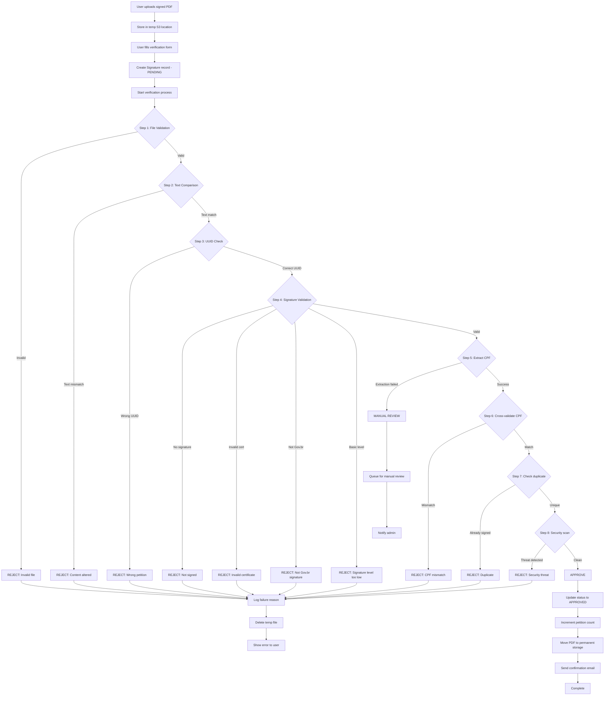

# Petição Brasil - Signature Verification

**Project Phase:** Planning - Phase 4  
**Document Version:** 1.1  
**Last Updated:** January 22, 2026  
**Status:** Draft  
**Domain:** peticaobrasil.com.br

---

## Table of Contents

1. [Verification Overview](#verification-overview)
2. [Technical Requirements](#technical-requirements)
3. [Library Selection](#library-selection)
4. [Verification Pipeline](#verification-pipeline)
5. [PDF Processing](#pdf-processing)
6. [Digital Signature Validation](#digital-signature-validation)
7. [CPF Extraction](#cpf-extraction)
8. [Cross-Validation](#cross-validation)
9. [Security Checks](#security-checks)
10. [Implementation Details](#implementation-details)
11. [Error Handling](#error-handling)
12. [Testing Strategy](#testing-strategy)

---

## Verification Overview

### Purpose

Automatically verify that uploaded signed PDFs are:
1. **Authentic** - Signed by Gov.br with valid ICP-Brasil certificate
2. **Unaltered** - Content matches original petition
3. **Legitimate** - Signer information matches form submission
4. **Unique** - CPF hasn't already signed this petition
5. **Secure** - Free from malware and tampering

### Verification Flow



### Success Criteria

**For automatic approval, ALL conditions must be met:**
- ✅ Valid PDF file format
- ✅ **Text content of signed PDF exactly matches text content of original PDF**
- ✅ Content hash matches original petition (secondary validation)
- ✅ UUID matches petition
- ✅ Contains valid digital signature
- ✅ Signature from ICP-Brasil CA (Gov.br)
- ✅ Signature level is Advanced or Qualified
- ✅ CPF extracted from certificate
- ✅ CPF matches form submission
- ✅ CPF not previously used for this petition
- ✅ No security threats detected

---

## Technical Requirements

### Input

1. **Uploaded PDF file** (from user)
   - Max size: 10MB
   - Format: PDF
   - Expected: Gov.br signed PDF

2. **Verification form data**
   - Full name
   - CPF
   - Email
   - City/State
   - Privacy preferences

3. **Petition reference**
   - Petition ID
   - Original content hash (from DB)
   - Petition UUID (from DB)

### Output

**Verification Result Object:**
```python
{
    'status': 'approved' | 'rejected' | 'manual_review',
    'signature_id': int,
    'steps_completed': {
        'file_validation': bool,
        'content_integrity': bool,
        'uuid_check': bool,
        'signature_validation': bool,
        'cpf_extraction': bool,
        'cross_validation': bool,
        'duplicate_check': bool,
        'security_scan': bool
    },
    'extracted_data': {
        'cpf': str,
        'name': str,
        'certificate_issuer': str,
        'signature_date': datetime,
        'signature_level': str
    },
    'failure_reason': str | None,
    'verification_notes': str
}
```

### Performance Requirements

- **Verification time:** < 30 seconds for 95% of cases
- **Success rate:** > 90% automatic verification (< 10% manual review)
- **False positive rate:** < 1% (incorrectly approved)
- **False negative rate:** < 5% (incorrectly rejected)

---

## Library Selection

### PDF Processing Libraries

#### 1. pdfplumber (Text Extraction)

**Version:** 0.10+  
**Purpose:** Extract text content from PDF  
**Why chosen:** Most reliable for complex PDFs, better layout preservation

```bash
pip install pdfplumber==0.10.3
```

**Pros:**
- ✅ Accurate text extraction
- ✅ Handles multi-column layouts
- ✅ Preserves text order
- ✅ Good Unicode support

**Cons:**
- ❌ Slower than alternatives
- ❌ Larger memory footprint

#### 2. PyPDF2 (Metadata Extraction)

**Version:** 3.0+  
**Purpose:** Extract PDF metadata (UUID)  
**Why chosen:** Simple, reliable for metadata operations

```bash
pip install PyPDF2==3.0.1
```

#### 3. pyHanko (Digital Signature Validation)

**Version:** 0.20+  
**Purpose:** Validate PDF digital signatures  
**Why chosen:** Best support for ICP-Brasil certificates, comprehensive validation

```bash
pip install pyHanko==0.20.1
pip install pyHanko-certvalidator==0.26.3
```

**Pros:**
- ✅ Excellent ICP-Brasil support
- ✅ Full signature validation
- ✅ Certificate chain verification
- ✅ Extracts signer information
- ✅ Checks signature integrity

**Cons:**
- ❌ Complex API
- ❌ Requires understanding of PKI

### Cryptography Libraries

```bash
pip install cryptography==41.0.7
pip install python-certifi-win32==1.6.1  # For Windows cert store
```

### Security Libraries

```bash
pip install python-magic==0.4.27  # File type detection
pip install clamd==1.0.2  # ClamAV integration (optional)
```

### Brazilian Document Validation

```bash
pip install validate-docbr==1.10.0  # CPF validation
```

---

## Verification Pipeline

### SignatureVerifier Service Class

```python
# democracia_direta/services/signature_verifier.py

from dataclasses import dataclass
from typing import Optional, Dict, Any
from datetime import datetime
import logging

logger = logging.getLogger(__name__)


@dataclass
class VerificationResult:
    """Result of signature verification process"""
    status: str  # 'approved', 'rejected', 'manual_review'
    steps_completed: Dict[str, bool]
    extracted_data: Dict[str, Any]
    failure_reason: Optional[str] = None
    verification_notes: str = ''
    
    def is_approved(self):
        return self.status == 'approved'
    
    def is_rejected(self):
        return self.status == 'rejected'
    
    def requires_manual_review(self):
        return self.status == 'manual_review'


class SignatureVerifier:
    """
    Automated verification of petition signatures.
    
    Implements multi-step verification pipeline to ensure
    signatures are authentic, valid, and legitimate.
    """
    
    def __init__(self, signature, uploaded_file):
        """
        Initialize verifier.
        
        Args:
            signature: Signature model instance (PENDING status)
            uploaded_file: Django UploadedFile object
        """
        self.signature = signature
        self.petition = signature.petition
        self.uploaded_file = uploaded_file
        
        # Initialize result tracking
        self.result = VerificationResult(
            status='pending',
            steps_completed={},
            extracted_data={},
            verification_notes=''
        )
        
        # Temporary file path (after saving to disk/S3)
        self.temp_pdf_path = None
    
    def verify(self) -> VerificationResult:
        """
        Execute complete verification pipeline.
        
        Returns:
            VerificationResult object
        """
        logger.info(f"Starting verification for signature {self.signature.uuid}")
        
        try:
            # Step 1: File Validation
            if not self._step1_file_validation():
                return self.result
            
            # Step 2: Content Integrity
            if not self._step2_content_integrity():
                return self.result
            
            # Step 3: UUID Check
            if not self._step3_uuid_check():
                return self.result
            
            # Step 4: Signature Validation
            if not self._step4_signature_validation():
                return self.result
            
            # Step 5: CPF Extraction
            if not self._step5_cpf_extraction():
                return self.result
            
            # Step 6: Cross-Validation
            if not self._step6_cross_validation():
                return self.result
            
            # Step 7: Duplicate Check
            if not self._step7_duplicate_check():
                return self.result
            
            # Step 8: Security Scan
            if not self._step8_security_scan():
                return self.result
            
            # All steps passed - APPROVE
            self.result.status = 'approved'
            self._log_notes("All verification steps passed successfully")
            
            logger.info(f"Signature {self.signature.uuid} APPROVED")
            
            return self.result
            
        except Exception as e:
            logger.error(f"Verification error for {self.signature.uuid}: {str(e)}")
            self.result.status = 'rejected'
            self.result.failure_reason = f"Sistema: Erro durante verificação - {str(e)}"
            return self.result
    
    def _step1_file_validation(self) -> bool:
        """
        Step 1: Validate uploaded file is a valid PDF.
        """
        from .pdf_validator import PDFValidator
        
        logger.info("Step 1: File validation")
        
        try:
            validator = PDFValidator(self.uploaded_file)
            
            # Check file type (magic bytes)
            if not validator.is_valid_pdf():
                self._reject("Arquivo não é um PDF válido")
                return False
            
            # Check file size
            if not validator.is_size_acceptable(max_size_mb=10):
                self._reject("Arquivo muito grande (máximo 10MB)")
                return False
            
            # Save to temporary location
            self.temp_pdf_path = self._save_temp_file()
            
            self.result.steps_completed['file_validation'] = True
            self._log_notes("Arquivo PDF válido")
            
            return True
            
        except Exception as e:
            self._reject(f"Erro na validação do arquivo: {str(e)}")
            return False
    
    def _step2_content_integrity(self) -> bool:
        """
        Step 2: Verify content integrity by comparing text between documents.
        
        This step ensures that the text content in the signed PDF exactly matches
        the text content in the original petition PDF. This prevents tampering.
        """
        from .pdf_validator import PDFValidator
        from .pdf_generator import PetitionPDFGenerator
        import hashlib
        
        logger.info("Step 2: Content integrity check - comparing document texts")
        
        try:
            # Extract text from the SIGNED PDF (uploaded by user)
            signed_validator = PDFValidator(self.temp_pdf_path)
            signed_text = signed_validator.extract_text()
            
            if not signed_text:
                self._reject("Não foi possível extrair texto do PDF assinado")
                return False
            
            # Normalize the signed PDF text
            normalized_signed_text = PetitionPDFGenerator._normalize_text(signed_text)
            
            # Extract text from the ORIGINAL petition PDF (stored in database)
            original_pdf_path = self._get_original_pdf_path()
            original_validator = PDFValidator(original_pdf_path)
            original_text = original_validator.extract_text()
            
            if not original_text:
                self._reject("Não foi possível extrair texto do PDF original")
                return False
            
            # Normalize the original PDF text
            normalized_original_text = PetitionPDFGenerator._normalize_text(original_text)
            
            # CRITICAL: Direct text comparison between the two documents
            if normalized_signed_text != normalized_original_text:
                self._reject("Conteúdo do PDF assinado não corresponde ao PDF original da petição")
                self._log_notes("Texto foi alterado entre o download e o upload")
                return False
            
            # Additional validation: Calculate hash of signed PDF text
            signed_hash = hashlib.sha256(normalized_signed_text.encode('utf-8')).hexdigest()
            
            # Compare with stored petition hash
            if signed_hash != self.petition.content_hash:
                self._reject("Hash do conteúdo não corresponde ao hash armazenado")
                self._log_notes(f"Hash esperado: {self.petition.content_hash[:16]}...")
                self._log_notes(f"Hash encontrado: {signed_hash[:16]}...")
                return False
            
            self.result.steps_completed['content_integrity'] = True
            self._log_notes("Integridade verificada: texto do PDF assinado é idêntico ao original")
            
            return True
            
        except Exception as e:
            self._reject(f"Erro na verificação de integridade: {str(e)}")
            return False
    
    def _step3_uuid_check(self) -> bool:
        """
        Step 3: Verify petition UUID matches.
        """
        from .pdf_validator import PDFValidator
        
        logger.info("Step 3: UUID verification")
        
        try:
            validator = PDFValidator(self.temp_pdf_path)
            
            # Extract UUID from metadata
            uuid_from_metadata = validator.extract_uuid_from_metadata()
            
            # Extract UUID from text
            uuid_from_text = validator.extract_uuid_from_text()
            
            petition_uuid = str(self.petition.uuid)
            
            # Check metadata UUID
            if uuid_from_metadata and uuid_from_metadata != petition_uuid:
                self._reject("UUID no metadata não corresponde à petição")
                return False
            
            # Check text UUID
            if uuid_from_text and uuid_from_text != petition_uuid:
                self._reject("UUID no texto não corresponde à petição")
                return False
            
            # At least one UUID must match
            if not uuid_from_metadata and not uuid_from_text:
                self._reject("UUID da petição não encontrado no documento")
                return False
            
            self.result.steps_completed['uuid_check'] = True
            self._log_notes(f"UUID verificado: {petition_uuid}")
            
            return True
            
        except Exception as e:
            self._reject(f"Erro na verificação de UUID: {str(e)}")
            return False
    
    def _step4_signature_validation(self) -> bool:
        """
        Step 4: Validate digital signature.
        """
        from .signature_validator import DigitalSignatureValidator
        
        logger.info("Step 4: Digital signature validation")
        
        try:
            validator = DigitalSignatureValidator(self.temp_pdf_path)
            
            # Check if PDF has signature
            if not validator.has_signature():
                self._reject("PDF não possui assinatura digital")
                return False
            
            # Validate signature
            sig_info = validator.validate_signature()
            
            if not sig_info['is_valid']:
                self._reject(f"Assinatura digital inválida: {sig_info.get('error', 'Desconhecido')}")
                return False
            
            # Check if signed by ICP-Brasil (Gov.br)
            if not sig_info['is_icp_brasil']:
                self._reject("Assinatura não é de certificado ICP-Brasil (Gov.br)")
                return False
            
            # Check signature level (reject Basic)
            signature_level = sig_info.get('signature_level', 'unknown')
            if signature_level.lower() in ['basic', 'básica']:
                self._reject("Assinatura Básica não é aceita. Use Avançada ou Qualificada.")
                return False
            
            # Store extracted signature info
            self.result.extracted_data.update({
                'certificate_issuer': sig_info.get('issuer'),
                'signature_date': sig_info.get('signature_date'),
                'signature_level': signature_level,
                'signer_name': sig_info.get('signer_name')
            })
            
            self.result.steps_completed['signature_validation'] = True
            self._log_notes(f"Assinatura válida - Nível: {signature_level}")
            
            return True
            
        except Exception as e:
            self._reject(f"Erro na validação da assinatura: {str(e)}")
            return False
    
    def _step5_cpf_extraction(self) -> bool:
        """
        Step 5: Extract CPF from certificate.
        """
        from .signature_validator import DigitalSignatureValidator
        
        logger.info("Step 5: CPF extraction")
        
        try:
            validator = DigitalSignatureValidator(self.temp_pdf_path)
            
            # Extract CPF from certificate
            cpf = validator.extract_cpf_from_certificate()
            
            if not cpf:
                # CPF extraction failed - send to manual review
                self._manual_review("Não foi possível extrair CPF do certificado automaticamente")
                return False
            
            # Validate CPF format
            from validate_docbr import CPF as CPFValidator
            cpf_validator = CPFValidator()
            
            if not cpf_validator.validate(cpf):
                self._reject(f"CPF extraído do certificado é inválido: {cpf}")
                return False
            
            # Store extracted CPF
            self.result.extracted_data['cpf'] = cpf
            
            self.result.steps_completed['cpf_extraction'] = True
            self._log_notes(f"CPF extraído: {cpf[:3]}.***.***-{cpf[-2:]}")
            
            return True
            
        except Exception as e:
            self._manual_review(f"Erro ao extrair CPF: {str(e)}")
            return False
    
    def _step6_cross_validation(self) -> bool:
        """
        Step 6: Cross-validate form data with certificate data.
        """
        logger.info("Step 6: Cross-validation")
        
        try:
            # Get CPF from certificate (extracted in step 5)
            cert_cpf = self.result.extracted_data.get('cpf')
            
            # Get CPF from form (stored as hash)
            from democracia_direta.models import Signature
            form_cpf_hash = self.signature.cpf_hash
            cert_cpf_hash = Signature.hash_cpf(cert_cpf)
            
            # Compare CPF hashes
            if cert_cpf_hash != form_cpf_hash:
                self._reject("CPF do formulário não corresponde ao CPF do certificado")
                return False
            
            # Optional: Compare names (fuzzy match)
            cert_name = self.result.extracted_data.get('signer_name', '')
            form_name = self.signature.full_name
            
            if cert_name and form_name:
                similarity = self._calculate_name_similarity(cert_name, form_name)
                
                if similarity < 0.7:  # 70% similarity threshold
                    self._manual_review(
                        f"Nome do formulário ({form_name}) difere do certificado ({cert_name}). "
                        f"Similaridade: {similarity:.0%}"
                    )
                    return False
                elif similarity < 0.9:
                    self._log_notes(f"Nome parcialmente correspondente (similaridade: {similarity:.0%})")
            
            self.result.steps_completed['cross_validation'] = True
            self._log_notes("Dados do formulário validados com certificado")
            
            return True
            
        except Exception as e:
            self._reject(f"Erro na validação cruzada: {str(e)}")
            return False
    
    def _step7_duplicate_check(self) -> bool:
        """
        Step 7: Check if CPF already signed this petition.
        """
        logger.info("Step 7: Duplicate check")
        
        try:
            from democracia_direta.models import Signature
            
            # Check for existing approved signatures with same CPF
            existing = Signature.objects.filter(
                petition=self.petition,
                cpf_hash=self.signature.cpf_hash,
                verification_status=Signature.STATUS_APPROVED
            ).exclude(
                id=self.signature.id
            ).exists()
            
            if existing:
                self._reject("Este CPF já assinou esta petição")
                return False
            
            self.result.steps_completed['duplicate_check'] = True
            self._log_notes("CPF único para esta petição")
            
            return True
            
        except Exception as e:
            self._reject(f"Erro na verificação de duplicidade: {str(e)}")
            return False
    
    def _step8_security_scan(self) -> bool:
        """
        Step 8: Security checks (malware, file integrity).
        """
        logger.info("Step 8: Security scan")
        
        try:
            # Check file size again (in case of manipulation)
            import os
            file_size = os.path.getsize(self.temp_pdf_path)
            
            if file_size > 10 * 1024 * 1024:  # 10MB
                self._reject("Arquivo excede tamanho máximo permitido")
                return False
            
            # Optional: ClamAV scan (if available)
            if self._is_clamav_available():
                if not self._scan_with_clamav():
                    self._reject("Arquivo contém conteúdo malicioso")
                    return False
            
            # Check PDF structure integrity
            from .pdf_validator import PDFValidator
            validator = PDFValidator(self.temp_pdf_path)
            
            if not validator.is_structure_valid():
                self._reject("Estrutura do PDF está corrompida ou inválida")
                return False
            
            self.result.steps_completed['security_scan'] = True
            self._log_notes("Verificações de segurança concluídas")
            
            return True
            
        except Exception as e:
            self._reject(f"Erro na verificação de segurança: {str(e)}")
            return False
    
    # Helper methods
    
    def _reject(self, reason: str):
        """Mark verification as rejected"""
        self.result.status = 'rejected'
        self.result.failure_reason = reason
        self._log_notes(f"REJEITADO: {reason}")
        logger.warning(f"Signature {self.signature.uuid} rejected: {reason}")
    
    def _manual_review(self, reason: str):
        """Mark verification for manual review"""
        self.result.status = 'manual_review'
        self.result.failure_reason = reason
        self._log_notes(f"REVISÃO MANUAL: {reason}")
        logger.info(f"Signature {self.signature.uuid} flagged for manual review: {reason}")
    
    def _log_notes(self, note: str):
        """Append to verification notes"""
        timestamp = datetime.now().strftime('%Y-%m-%d %H:%M:%S')
        self.result.verification_notes += f"[{timestamp}] {note}\n"
    
    def _save_temp_file(self) -> str:
        """Save uploaded file to temporary location"""
        import tempfile
        import os
        
        # Create temp file
        temp_dir = tempfile.gettempdir()
        temp_filename = f"sig_{self.signature.uuid}.pdf"
        temp_path = os.path.join(temp_dir, temp_filename)
        
        # Write uploaded file to temp location
        with open(temp_path, 'wb') as f:
            for chunk in self.uploaded_file.chunks():
                f.write(chunk)
        
        return temp_path
    
    def _calculate_name_similarity(self, name1: str, name2: str) -> float:
        """
        Calculate similarity between two names.
        Uses Levenshtein distance.
        """
        from difflib import SequenceMatcher
        
        # Normalize names
        n1 = name1.lower().strip()
        n2 = name2.lower().strip()
        
        # Calculate similarity ratio
        return SequenceMatcher(None, n1, n2).ratio()
    
    def _is_clamav_available(self) -> bool:
        """Check if ClamAV is available"""
        try:
            import clamd
            cd = clamd.ClamdUnixSocket()
            cd.ping()
            return True
        except:
            return False
    
    def _scan_with_clamav(self) -> bool:
        """Scan file with ClamAV"""
        try:
            import clamd
            cd = clamd.ClamdUnixSocket()
            result = cd.scan(self.temp_pdf_path)
            
            # result is None if clean, or dict with virus info
            return result is None
        except Exception as e:
            logger.warning(f"ClamAV scan failed: {e}")
            return True  # Allow if scan fails
    
    def _get_original_pdf_path(self) -> str:
        """
        Get the path to the original petition PDF.
        Downloads from S3 or retrieves from local storage.
        
        Returns:
            str: Local file path to original petition PDF
        """
        import tempfile
        import os
        import requests
        
        # Check if petition has PDF URL
        if not self.petition.pdf_url:
            raise ValueError(f"Petition {self.petition.id} has no PDF URL")
        
        # Create temp file for original PDF
        temp_dir = tempfile.gettempdir()
        original_filename = f"petition_{self.petition.uuid}_original.pdf"
        original_path = os.path.join(temp_dir, original_filename)
        
        # Check if already downloaded
        if os.path.exists(original_path):
            return original_path
        
        # Download original PDF from S3/storage
        try:
            response = requests.get(self.petition.pdf_url, timeout=30)
            response.raise_for_status()
            
            with open(original_path, 'wb') as f:
                f.write(response.content)
            
            logger.info(f"Downloaded original PDF for petition {self.petition.uuid}")
            return original_path
            
        except Exception as e:
            raise Exception(f"Failed to download original PDF: {str(e)}")
```

---

## PDF Processing

### PDF Validator Class

```python
# democracia_direta/services/pdf_validator.py

import pdfplumber
from PyPDF2 import PdfReader
import magic
import re
from typing import Optional


class PDFValidator:
    """
    Validate and extract data from PDF files.
    """
    
    def __init__(self, file_path):
        """
        Initialize validator with file path.
        
        Args:
            file_path: Path to PDF file (string or file-like object)
        """
        self.file_path = file_path
    
    def is_valid_pdf(self) -> bool:
        """
        Check if file is a valid PDF using magic bytes.
        """
        try:
            # Check magic bytes
            mime = magic.Magic(mime=True)
            file_type = mime.from_file(self.file_path)
            
            return file_type == 'application/pdf'
        except:
            # Fallback: check file header
            try:
                with open(self.file_path, 'rb') as f:
                    header = f.read(4)
                    return header == b'%PDF'
            except:
                return False
    
    def is_size_acceptable(self, max_size_mb: int = 10) -> bool:
        """
        Check if file size is acceptable.
        """
        import os
        
        try:
            size_bytes = os.path.getsize(self.file_path)
            size_mb = size_bytes / (1024 * 1024)
            return size_mb <= max_size_mb
        except:
            return False
    
    def extract_text(self) -> str:
        """
        Extract all text from PDF.
        """
        try:
            text_parts = []
            
            with pdfplumber.open(self.file_path) as pdf:
                for page in pdf.pages:
                    page_text = page.extract_text()
                    if page_text:
                        text_parts.append(page_text)
            
            return '\n\n'.join(text_parts)
        except Exception as e:
            raise Exception(f"Failed to extract text: {str(e)}")
    
    def extract_uuid_from_metadata(self) -> Optional[str]:
        """
        Extract petition UUID from PDF metadata.
        """
        try:
            reader = PdfReader(self.file_path)
            metadata = reader.metadata
            
            if metadata:
                # Try custom field
                if '/PetitionUUID' in metadata:
                    return metadata['/PetitionUUID']
                
                # Try variations
                for key in metadata.keys():
                    if 'uuid' in key.lower():
                        return metadata[key]
            
            return None
        except:
            return None
    
    def extract_uuid_from_text(self) -> Optional[str]:
        """
        Extract petition UUID from PDF text content.
        """
        try:
            text = self.extract_text()
            
            # UUID pattern: 8-4-4-4-12 hexadecimal
            pattern = r'([0-9a-f]{8}-[0-9a-f]{4}-[0-9a-f]{4}-[0-9a-f]{4}-[0-9a-f]{12})'
            
            matches = re.findall(pattern, text, re.IGNORECASE)
            
            if matches:
                # Return first UUID found
                return matches[0]
            
            return None
        except:
            return None
    
    def is_structure_valid(self) -> bool:
        """
        Check if PDF structure is valid.
        """
        try:
            reader = PdfReader(self.file_path)
            
            # Check if PDF can be read
            if len(reader.pages) == 0:
                return False
            
            # Try to access first page
            _ = reader.pages[0]
            
            return True
        except:
            return False
```

---

## Digital Signature Validation

### Signature Validator Class

```python
# democracia_direta/services/signature_validator.py

from pyhanko.sign import validation
from pyhanko.pdf_utils.reader import PdfFileReader
from pyhanko_certvalidator import ValidationContext
from typing import Dict, Any, Optional
import logging

logger = logging.getLogger(__name__)


class DigitalSignatureValidator:
    """
    Validate PDF digital signatures using pyHanko.
    """
    
    # ICP-Brasil root CAs (certificate authorities)
    ICP_BRASIL_CAS = [
        'Autoridade Certificadora Raiz Brasileira',
        'AC Raiz',
        'ICP-Brasil',
        'Serpro',
    ]
    
    def __init__(self, pdf_path: str):
        """
        Initialize validator with PDF path.
        
        Args:
            pdf_path: Path to signed PDF file
        """
        self.pdf_path = pdf_path
        self.reader = None
        self.embedded_sigs = []
    
    def has_signature(self) -> bool:
        """
        Check if PDF has digital signature.
        """
        try:
            with open(self.pdf_path, 'rb') as f:
                self.reader = PdfFileReader(f)
                self.embedded_sigs = list(self.reader.embedded_signatures)
                
                return len(self.embedded_sigs) > 0
        except Exception as e:
            logger.error(f"Error checking signature: {e}")
            return False
    
    def validate_signature(self) -> Dict[str, Any]:
        """
        Validate digital signature and extract information.
        
        Returns:
            Dict with signature information:
            {
                'is_valid': bool,
                'is_icp_brasil': bool,
                'signer_name': str,
                'issuer': str,
                'signature_date': datetime,
                'signature_level': str,
                'error': str (if invalid)
            }
        """
        try:
            if not self.embedded_sigs:
                self.has_signature()
            
            if not self.embedded_sigs:
                return {
                    'is_valid': False,
                    'error': 'No signature found'
                }
            
            # Get first signature (most recent)
            sig = self.embedded_sigs[0]
            
            # Create validation context
            vc = ValidationContext(allow_fetching=True)
            
            # Validate signature
            status = validation.validate_pdf_signature(sig, vc)
            
            # Extract signer certificate
            signer_cert = sig.signer_cert
            
            # Get certificate details
            signer_info = self._extract_signer_info(signer_cert)
            
            # Check if ICP-Brasil
            is_icp_brasil = self._is_icp_brasil_cert(signer_cert)
            
            # Get signature level
            sig_level = self._get_signature_level(sig)
            
            return {
                'is_valid': status.bottom_line,
                'is_icp_brasil': is_icp_brasil,
                'signer_name': signer_info.get('common_name'),
                'issuer': signer_info.get('issuer'),
                'signature_date': sig.signed_dt,
                'signature_level': sig_level,
                'trust_status': str(status.trust_problem_indic) if hasattr(status, 'trust_problem_indic') else 'unknown'
            }
            
        except Exception as e:
            logger.error(f"Signature validation error: {e}")
            return {
                'is_valid': False,
                'error': str(e)
            }
    
    def extract_cpf_from_certificate(self) -> Optional[str]:
        """
        Extract CPF from certificate.
        
        ICP-Brasil certificates store CPF in:
        - Subject Alternative Name (SAN) extension
        - Subject DN (DistinguishedName)
        - OID 2.16.76.1.3.1 (CPF field)
        
        Returns:
            str: CPF without formatting (11 digits)
        """
        try:
            if not self.embedded_sigs:
                self.has_signature()
            
            if not self.embedded_sigs:
                return None
            
            sig = self.embedded_sigs[0]
            cert = sig.signer_cert
            
            # Method 1: Check OID 2.16.76.1.3.1 (ICP-Brasil CPF field)
            cpf = self._extract_cpf_from_oid(cert)
            if cpf:
                return cpf
            
            # Method 2: Check Subject Alternative Name
            cpf = self._extract_cpf_from_san(cert)
            if cpf:
                return cpf
            
            # Method 3: Check Subject DN fields
            cpf = self._extract_cpf_from_subject(cert)
            if cpf:
                return cpf
            
            logger.warning("Could not extract CPF from certificate")
            return None
            
        except Exception as e:
            logger.error(f"CPF extraction error: {e}")
            return None
    
    def _extract_signer_info(self, cert) -> Dict[str, str]:
        """Extract information from signer certificate"""
        try:
            subject = cert.subject
            issuer = cert.issuer
            
            # Extract common name (CN)
            cn = None
            for attr in subject:
                if attr.oid._name == 'commonName':
                    cn = attr.value
                    break
            
            # Extract issuer
            issuer_cn = None
            for attr in issuer:
                if attr.oid._name == 'commonName':
                    issuer_cn = attr.value
                    break
            
            return {
                'common_name': cn,
                'issuer': issuer_cn
            }
        except:
            return {}
    
    def _is_icp_brasil_cert(self, cert) -> bool:
        """Check if certificate is from ICP-Brasil"""
        try:
            issuer = cert.issuer
            
            issuer_str = str(issuer)
            
            # Check if any ICP-Brasil CA is in issuer chain
            for ca in self.ICP_BRASIL_CAS:
                if ca.lower() in issuer_str.lower():
                    return True
            
            # Check certificate policies for ICP-Brasil OID
            # ICP-Brasil OID: 2.16.76.1.*
            try:
                for ext in cert.extensions:
                    if ext.oid._name == 'certificatePolicies':
                        policies_str = str(ext.value)
                        if '2.16.76.1' in policies_str:
                            return True
            except:
                pass
            
            return False
        except:
            return False
    
    def _get_signature_level(self, sig) -> str:
        """
        Determine signature level (Basic, Advanced, Qualified).
        
        This is a simplified check. Full implementation would
        analyze signature attributes and certificate type.
        """
        try:
            cert = sig.signer_cert
            
            # Check for timestamp (Advanced/Qualified have timestamp)
            has_timestamp = hasattr(sig, 'timestamp_validity') and sig.timestamp_validity is not None
            
            # Check certificate type (A1, A3, etc.)
            # A3 certificates (hardware) = Qualified
            # A1 certificates (software) = Advanced
            
            # Simplified logic:
            if has_timestamp:
                # Check if hardware certificate (A3)
                # This requires checking certificate key usage
                # For now, assume Advanced
                return 'Advanced'
            else:
                return 'Basic'
            
        except:
            return 'Unknown'
    
    def _extract_cpf_from_oid(self, cert) -> Optional[str]:
        """
        Extract CPF from OID 2.16.76.1.3.1.
        This is the standard ICP-Brasil CPF field.
        """
        import re
        
        try:
            # Get certificate extensions
            for ext in cert.extensions:
                # Subject Alternative Name extension
                if ext.oid._name == 'subjectAltName':
                    san_value = str(ext.value)
                    
                    # Look for CPF pattern in SAN
                    # Format: otherName:OID.2.16.76.1.3.1:12345678900
                    cpf_match = re.search(r'2\.16\.76\.1\.3\.1[^\d]*(\d{11})', san_value)
                    if cpf_match:
                        return cpf_match.group(1)
            
            return None
        except:
            return None
    
    def _extract_cpf_from_san(self, cert) -> Optional[str]:
        """Extract CPF from Subject Alternative Name"""
        import re
        
        try:
            for ext in cert.extensions:
                if ext.oid._name == 'subjectAltName':
                    san_str = str(ext.value)
                    
                    # Look for CPF pattern (11 digits)
                    cpf_match = re.search(r'\b(\d{11})\b', san_str)
                    if cpf_match:
                        cpf = cpf_match.group(1)
                        
                        # Validate CPF
                        from validate_docbr import CPF as CPFValidator
                        validator = CPFValidator()
                        if validator.validate(cpf):
                            return cpf
            
            return None
        except:
            return None
    
    def _extract_cpf_from_subject(self, cert) -> Optional[str]:
        """Extract CPF from Subject DN fields"""
        import re
        
        try:
            subject = cert.subject
            
            # Check each attribute
            for attr in subject:
                value = str(attr.value)
                
                # Look for CPF pattern
                cpf_match = re.search(r'\b(\d{11})\b', value)
                if cpf_match:
                    cpf = cpf_match.group(1)
                    
                    # Validate CPF
                    from validate_docbr import CPF as CPFValidator
                    validator = CPFValidator()
                    if validator.validate(cpf):
                        return cpf
            
            return None
        except:
            return None
```

---

## Cross-Validation

### Name Similarity Calculation

```python
# democracia_direta/utils/validators.py

from difflib import SequenceMatcher
import re


def calculate_name_similarity(name1: str, name2: str) -> float:
    """
    Calculate similarity between two names.
    
    Uses multiple strategies:
    1. Exact match
    2. Normalized match (lowercase, no accents)
    3. Levenshtein distance
    4. Token match (order-independent)
    
    Returns:
        float: Similarity score (0.0 to 1.0)
    """
    # Normalize names
    n1 = normalize_name(name1)
    n2 = normalize_name(name2)
    
    # Exact match
    if n1 == n2:
        return 1.0
    
    # Calculate sequence similarity
    seq_similarity = SequenceMatcher(None, n1, n2).ratio()
    
    # Calculate token-based similarity (order-independent)
    tokens1 = set(n1.split())
    tokens2 = set(n2.split())
    
    if tokens1 and tokens2:
        intersection = tokens1 & tokens2
        union = tokens1 | tokens2
        token_similarity = len(intersection) / len(union)
    else:
        token_similarity = 0.0
    
    # Return weighted average
    return (seq_similarity * 0.6) + (token_similarity * 0.4)


def normalize_name(name: str) -> str:
    """
    Normalize name for comparison.
    
    - Convert to lowercase
    - Remove accents
    - Remove extra whitespace
    - Remove common abbreviations
    """
    import unicodedata
    
    # Convert to lowercase
    name = name.lower()
    
    # Remove accents
    name = ''.join(
        c for c in unicodedata.normalize('NFD', name)
        if unicodedata.category(c) != 'Mn'
    )
    
    # Remove common abbreviations
    abbreviations = {
        ' jr.': '',
        ' sr.': '',
        ' filho': '',
        ' neto': '',
        ' junior': '',
        ' senior': '',
    }
    
    for abbr, replacement in abbreviations.items():
        name = name.replace(abbr, replacement)
    
    # Remove multiple spaces
    name = re.sub(r'\s+', ' ', name)
    
    # Trim
    name = name.strip()
    
    return name
```

---

## Security Checks

### ClamAV Integration (Optional)

```python
# democracia_direta/utils/security.py

import clamd
import logging

logger = logging.getLogger(__name__)


def scan_file_with_clamav(file_path: str) -> Dict[str, Any]:
    """
    Scan file with ClamAV antivirus.
    
    Returns:
        {
            'is_clean': bool,
            'threats': list,
            'error': str (if scan failed)
        }
    """
    try:
        # Connect to ClamAV daemon
        cd = clamd.ClamdUnixSocket()
        
        # Ping to check connection
        cd.ping()
        
        # Scan file
        result = cd.scan(file_path)
        
        if result is None:
            # File is clean
            return {
                'is_clean': True,
                'threats': []
            }
        else:
            # Threats found
            threats = []
            for file, (status, virus_name) in result.items():
                if status == 'FOUND':
                    threats.append(virus_name)
            
            return {
                'is_clean': False,
                'threats': threats
            }
    
    except clamd.ConnectionError:
        logger.warning("ClamAV not available")
        return {
            'is_clean': True,  # Assume clean if ClamAV unavailable
            'error': 'ClamAV not available'
        }
    
    except Exception as e:
        logger.error(f"ClamAV scan error: {e}")
        return {
            'is_clean': True,  # Assume clean on error
            'error': str(e)
        }
```

---

## Implementation Details

### Celery Task (Async Verification)

```python
# democracia_direta/tasks.py

from celery import shared_task
from .models import Signature
from .services.signature_verifier import SignatureVerifier
import logging

logger = logging.getLogger(__name__)


@shared_task(bind=True, max_retries=2)
def verify_signature_task(self, signature_id, temp_file_path):
    """
    Async task to verify signature.
    
    Args:
        signature_id: ID of Signature model instance
        temp_file_path: Path to uploaded PDF file
    """
    try:
        # Get signature
        signature = Signature.objects.get(id=signature_id)
        
        # Update status to PROCESSING
        signature.verification_status = Signature.STATUS_PROCESSING
        signature.save(update_fields=['verification_status'])
        
        # Run verification
        verifier = SignatureVerifier(signature, temp_file_path)
        result = verifier.verify()
        
        # Update signature based on result
        if result.is_approved():
            signature.verification_status = Signature.STATUS_APPROVED
            signature.verified_cpf_from_certificate = True
            signature.certificate_info = result.extracted_data
            signature.approve()  # Increments petition count
            
        elif result.requires_manual_review():
            signature.verification_status = Signature.STATUS_MANUAL_REVIEW
            signature.verification_notes = result.verification_notes
            
            # Notify admins
            from .utils.notifications import notify_admins_manual_review
            notify_admins_manual_review(signature)
            
        else:  # Rejected
            signature.verification_status = Signature.STATUS_REJECTED
            signature.verification_notes = result.verification_notes
        
        signature.save()
        
        # Send email to signer
        from .utils.notifications import send_verification_result_email
        send_verification_result_email(signature, result)
        
        logger.info(f"Verification complete for signature {signature_id}: {result.status}")
        
        return {
            'signature_id': signature_id,
            'status': result.status
        }
        
    except Signature.DoesNotExist:
        logger.error(f"Signature {signature_id} not found")
        return {'error': 'Signature not found'}
        
    except Exception as e:
        logger.error(f"Verification error for signature {signature_id}: {e}")
        
        # Retry task
        raise self.retry(exc=e, countdown=120)
```

---

## Error Handling

### User-Friendly Error Messages

```python
# Map technical errors to user-friendly messages

ERROR_MESSAGES = {
    'invalid_file': 'O arquivo enviado não é um PDF válido. Por favor, envie apenas arquivos PDF.',
    
    'file_too_large': 'O arquivo é muito grande. O tamanho máximo é 10MB.',
    
    'content_altered': 'O conteúdo da petição foi alterado. Por favor, baixe o PDF original novamente e assine sem modificações.',
    
    'wrong_petition': 'Este PDF não corresponde à petição selecionada. Verifique se você baixou o PDF correto.',
    
    'not_signed': 'O PDF não possui assinatura digital. Por favor, assine o documento via Gov.br antes de enviar.',
    
    'invalid_signature': 'A assinatura digital é inválida ou foi corrompida. Por favor, assine novamente.',
    
    'not_govbr': 'A assinatura não é de um certificado Gov.br válido. Certifique-se de usar o sistema oficial de assinatura Gov.br.',
    
    'basic_signature': 'Assinatura Básica não é aceita. Por favor, use assinatura Avançada ou Qualificada no sistema Gov.br.',
    
    'cpf_extraction_failed': 'Não foi possível extrair o CPF do certificado automaticamente. Sua assinatura foi enviada para revisão manual.',
    
    'cpf_mismatch': 'O CPF do certificado não corresponde ao CPF informado no formulário. Verifique se preencheu corretamente.',
    
    'duplicate_signature': 'Este CPF já assinou esta petição. Cada pessoa pode assinar apenas uma vez.',
    
    'security_threat': 'O arquivo foi bloqueado por motivos de segurança. Se você acredita que isso é um erro, entre em contato conosco.',
    
    'unknown_error': 'Ocorreu um erro durante a verificação. Por favor, tente novamente ou entre em contato com o suporte.',
}


def get_user_friendly_error(error_code: str, technical_message: str = '') -> str:
    """
    Get user-friendly error message.
    
    Args:
        error_code: Error code from verification
        technical_message: Technical error details (for logging)
    
    Returns:
        str: User-friendly message
    """
    return ERROR_MESSAGES.get(error_code, ERROR_MESSAGES['unknown_error'])
```

---

## Testing Strategy

### Unit Tests

```python
# democracia_direta/tests/test_signature_verifier.py

from django.test import TestCase
from django.contrib.auth.models import User
from democracia_direta.models import Category, Petition, Signature
from democracia_direta.services.signature_verifier import SignatureVerifier
from unittest.mock import Mock, patch
import os


class SignatureVerifierTestCase(TestCase):
    
    def setUp(self):
        # Create test data
        self.user = User.objects.create_user('testuser', 'test@example.com')
        self.category = Category.objects.create(name='Test', slug='test')
        self.petition = Petition.objects.create(
            creator=self.user,
            category=self.category,
            title='Test Petition',
            description='Test description',
            signature_goal=100,
            content_hash='abc123' * 10  # 64 char hash
        )
        
        self.signature = Signature.objects.create(
            petition=self.petition,
            full_name='João Silva',
            cpf_hash=Signature.hash_cpf('12345678900'),
            email='joao@example.com',
            city='São Paulo',
            state='SP'
        )
    
    def test_file_validation_rejects_non_pdf(self):
        """Test that non-PDF files are rejected"""
        # Create mock file
        mock_file = Mock()
        mock_file.name = 'test.txt'
        
        verifier = SignatureVerifier(self.signature, mock_file)
        result = verifier._step1_file_validation()
        
        self.assertFalse(result)
        self.assertEqual(verifier.result.status, 'rejected')
    
    @patch('democracia_direta.services.pdf_validator.PDFValidator')
    def test_content_integrity_check(self, mock_validator):
        """Test content integrity verification"""
        # Mock PDF validator
        mock_validator.return_value.extract_text.return_value = 'Test Petition\n\nTest description'
        
        verifier = SignatureVerifier(self.signature, Mock())
        verifier.temp_pdf_path = '/tmp/test.pdf'
        
        # This will fail because hash won't match
        # (we'd need to generate proper hash for test)
        result = verifier._step2_content_integrity()
        
        # Just verify method was called
        mock_validator.return_value.extract_text.assert_called_once()
    
    def test_duplicate_check_rejects_duplicate_cpf(self):
        """Test duplicate CPF detection"""
        # Create existing approved signature with same CPF
        Signature.objects.create(
            petition=self.petition,
            full_name='Maria Santos',
            cpf_hash=self.signature.cpf_hash,  # Same CPF
            email='maria@example.com',
            city='Rio de Janeiro',
            state='RJ',
            verification_status=Signature.STATUS_APPROVED
        )
        
        verifier = SignatureVerifier(self.signature, Mock())
        result = verifier._step7_duplicate_check()
        
        self.assertFalse(result)
        self.assertIn('já assinou', verifier.result.failure_reason)
```

### Integration Tests

```python
# democracia_direta/tests/test_signature_integration.py

from django.test import TestCase
from django.core.files.uploadedfile import SimpleUploadedFile
import os


class SignatureIntegrationTestCase(TestCase):
    
    fixtures = ['categories.json']
    
    def test_complete_signature_flow(self):
        """Test complete signature verification flow"""
        # This would require:
        # 1. Real test PDF signed with Gov.br
        # 2. S3 or local storage configured
        # 3. All verification steps
        
        # Skip in normal test runs
        if not os.environ.get('RUN_INTEGRATION_TESTS'):
            self.skipTest('Integration tests disabled')
        
        # Create petition
        # Upload signed PDF
        # Run verification
        # Assert result
        pass
```

---

## Performance Optimization

### Caching Verification Results

```python
from django.core.cache import cache


def get_verification_result_cached(signature_id):
    """
    Get verification result from cache if available.
    """
    cache_key = f'verification_result_{signature_id}'
    result = cache.get(cache_key)
    
    if result is None:
        # Run verification
        signature = Signature.objects.get(id=signature_id)
        # ... verification logic ...
        
        # Cache for 1 hour
        cache.set(cache_key, result, 3600)
    
    return result
```

---

## Next Steps

1. ✅ Complete signature verification documentation
2. ⏭️ Proceed to Phase 5: User Interface and UX
3. ⏭️ Implement verification service classes
4. ⏭️ Set up pyHanko and test with Gov.br certificates
5. ⏭️ Create manual review queue for admins
6. ⏭️ Test with real Gov.br signed PDFs

---

**Document Status:** Complete. Ready for implementation and Phase 5 planning.
