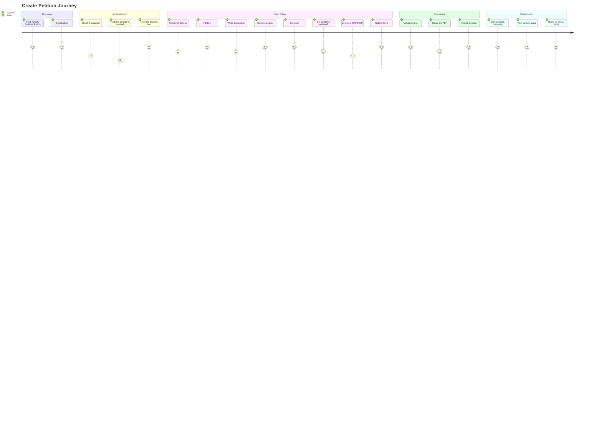
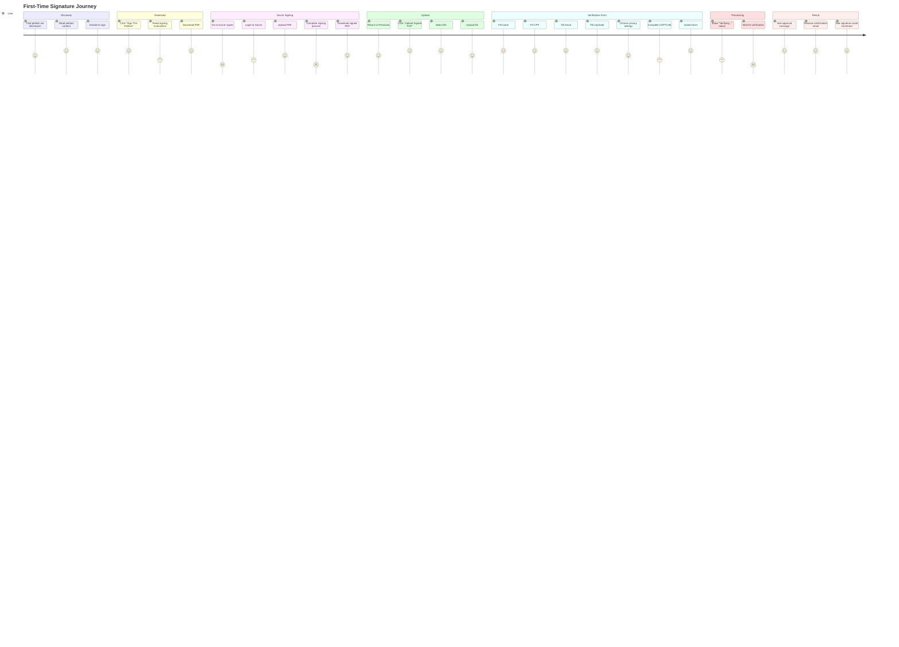
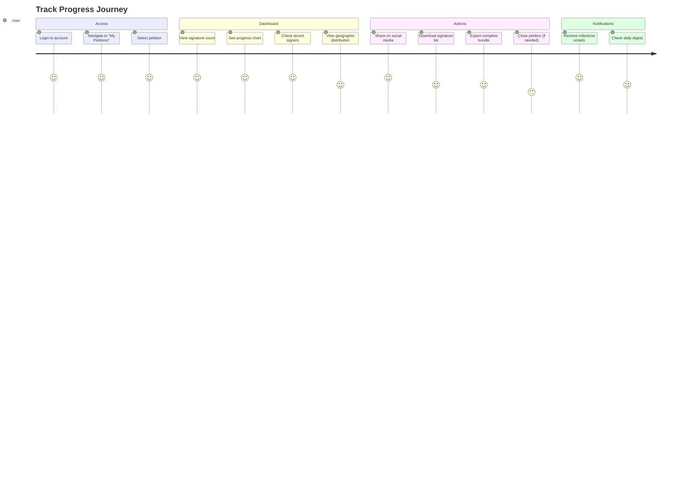

# Democracia Direta - User Interface and UX

**Project Phase:** Planning - Phase 5  
**Document Version:** 1.0  
**Last Updated:** November 23, 2025  
**Status:** Draft

---

## Table of Contents

1. [Design Philosophy](#design-philosophy)
2. [User Journeys](#user-journeys)
3. [Page Specifications](#page-specifications)
4. [Wireframes](#wireframes)
5. [Component Library](#component-library)
6. [Forms Design](#forms-design)
7. [Responsive Design](#responsive-design)
8. [Accessibility](#accessibility)
9. [SEO Optimization](#seo-optimization)

---

## Design Philosophy

### Core Principles

1. **Simplicity First**
   - Clear, uncluttered interfaces
   - Progressive disclosure of information
   - Focus on primary actions

2. **Trust and Transparency**
   - Clear explanation of Gov.br signing process
   - Real-time feedback on verification status
   - Visible petition progress and statistics

3. **Accessibility**
   - WCAG 2.1 AA compliance
   - Keyboard navigation support
   - Screen reader friendly

4. **Mobile-First**
   - Design for mobile, enhance for desktop
   - Touch-friendly controls
   - Optimized for varying screen sizes

5. **Consistent with Pressiona**
   - Reuse existing Pressiona design patterns
   - Maintain brand consistency
   - Extend rather than replace

### Visual Design System

**Colors (from Pressiona):**
```css
/* Primary Colors */
--primary-blue: #0066CC;
--primary-dark: #004C99;
--primary-light: #3385D6;

/* Secondary Colors */
--text-primary: #333333;
--text-secondary: #666666;
--text-muted: #999999;

/* Accent Colors */
--accent-orange: #FF6B35;
--accent-green: #28A745;
--accent-red: #DC3545;
--accent-yellow: #FFC107;

/* Neutrals */
--gray-100: #F8F9FA;
--gray-200: #E9ECEF;
--gray-300: #DEE2E6;
--gray-400: #CED4DA;
--gray-500: #ADB5BD;

/* Background */
--bg-white: #FFFFFF;
--bg-light: #F5F5F5;
```

**Typography:**
```css
/* Font Family */
--font-primary: 'Helvetica Neue', Helvetica, Arial, sans-serif;
--font-monospace: 'Courier New', monospace;

/* Font Sizes */
--text-xs: 0.75rem;    /* 12px */
--text-sm: 0.875rem;   /* 14px */
--text-base: 1rem;      /* 16px */
--text-lg: 1.125rem;    /* 18px */
--text-xl: 1.25rem;     /* 20px */
--text-2xl: 1.5rem;     /* 24px */
--text-3xl: 1.875rem;   /* 30px */

/* Font Weights */
--font-normal: 400;
--font-medium: 500;
--font-semibold: 600;
--font-bold: 700;
```

**Spacing:**
```css
/* Using 8px grid system */
--space-1: 0.5rem;   /* 8px */
--space-2: 1rem;     /* 16px */
--space-3: 1.5rem;   /* 24px */
--space-4: 2rem;     /* 32px */
--space-5: 2.5rem;   /* 40px */
--space-6: 3rem;     /* 48px */
```

---

## User Journeys

### Journey 1: Creating a Petition

**Actor:** Authenticated User  
**Goal:** Create and publish a new petition



**Pain Points to Address:**
- Form validation feedback (inline, real-time)
- Character counters for title/description
- Category selection with examples
- Clear deadline requirements
- CAPTCHA accessibility
- Loading states during submission

---

### Journey 2: Signing a Petition (First-Time Signer)

**Actor:** Anonymous Visitor  
**Goal:** Sign a petition using Gov.br



**Pain Points to Address:**
- Gov.br process complexity (BIGGEST CHALLENGE)
- Step-by-step instructions with screenshots
- Clear error messages if verification fails
- Real-time verification status updates
- Mobile-friendly file upload
- Form auto-fill where possible

---

### Journey 3: Tracking Petition Progress (Creator)

**Actor:** Petition Creator  
**Goal:** Monitor petition signatures and progress



---

## Page Specifications

### 1. Petition List Page

**URL:** `/peticoes/`

**Purpose:** Browse and discover active petitions

**Layout:**
```
┌─────────────────────────────────────────────────────────┐
│ HEADER (from base.html)                                 │
├─────────────────────────────────────────────────────────┤
│                                                         │
│  Petições Públicas                        [Criar Nova] │
│  ─────────────────────────────────────────────────────  │
│                                                         │
│  [Search: "Buscar petições..."]           🔍           │
│                                                         │
│  Filtros:  [Todas] [Saúde] [Educação] [Ambiente] ...  │
│           [Ativas] [Concluídas] [Expirando]           │
│                                                         │
│  Ordenar: [Mais recentes ▼]                            │
│                                                         │
├─────────────────────────────────────────────────────────┤
│                                                         │
│  ┌─────────────────────────────────────────────────┐  │
│  │ [SAÚDE]                                         │  │
│  │ Melhoria do atendimento no Hospital Municipal   │  │
│  │                                                 │  │
│  │ Por João Silva • 15/11/2025                     │  │
│  │                                                 │  │
│  │ ████████████░░░░░░░░░░ 2.547 / 5.000 (51%)     │  │
│  │                                                 │  │
│  │ 📍 São Paulo, SP • ⏰ 45 dias restantes         │  │
│  └─────────────────────────────────────────────────┘  │
│                                                         │
│  ┌─────────────────────────────────────────────────┐  │
│  │ [EDUCAÇÃO]                                      │  │
│  │ Construção de biblioteca escolar               │  │
│  │ ...                                             │  │
│  └─────────────────────────────────────────────────┘  │
│                                                         │
│  [Carregar mais...]                                    │
│                                                         │
└─────────────────────────────────────────────────────────┘
```

**Key Elements:**

1. **Hero Section**
   - Page title: "Petições Públicas"
   - "Criar Nova" button (primary CTA)
   - Brief explanation text

2. **Search Bar**
   - Full-width search input
   - Placeholder: "Buscar petições..."
   - Instant search (debounced)

3. **Filter Pills**
   - Category filters (clickable badges)
   - Status filters (Ativas, Concluídas, Expirando)
   - Active filter highlighted

4. **Sort Dropdown**
   - Options:
     - Mais recentes
     - Mais assinaturas
     - Perto da meta
     - Expirando em breve

5. **Petition Cards** (repeating)
   - Category badge (colored)
   - Title (clickable, 2 lines max)
   - Creator + date
   - Progress bar (visual + numbers)
   - Location + deadline
   - Hover effect

6. **Pagination**
   - Load more button (infinite scroll optional)
   - Shows count: "Mostrando 20 de 150 petições"

**Responsive Behavior:**
- Desktop: 2 columns of cards
- Tablet: 2 columns (narrower)
- Mobile: 1 column (full width)

---

### 2. Petition Detail Page

**URL:** `/peticoes/<id>/<slug>/`

**Purpose:** View complete petition and take action

**Layout:**
```
┌─────────────────────────────────────────────────────────┐
│ HEADER                                                  │
├─────────────────────────────────────────────────────────┤
│                                                         │
│  ← Voltar   [SAÚDE]                    [Compartilhar ▼]│
│                                                         │
│  ┌───────────────────────────────────────────────────┐ │
│  │                                                   │ │
│  │  Melhoria do atendimento no                       │ │
│  │  Hospital Municipal                               │ │
│  │                                                   │ │
│  │  Por João Silva • Criado em 15/11/2025           │ │
│  │                                                   │ │
│  └───────────────────────────────────────────────────┘ │
│                                                         │
│  ┌─────────────────────────────────────────────────┐   │
│  │ ████████████████░░░░░░░  2.547 / 5.000          │   │
│  │                                                 │   │
│  │ 51% da meta • 45 dias restantes                 │   │
│  └─────────────────────────────────────────────────┘   │
│                                                         │
│  ╔═══════════════════════════════════════════════════╗ │
│  ║  [📝 ASSINAR ESTA PETIÇÃO]                       ║ │
│  ╚═══════════════════════════════════════════════════╝ │
│                                                         │
├─────────────────────────────────────────────────────────┤
│                                                         │
│  DESCRIÇÃO                                              │
│  ─────────────────────────────────────────────────────  │
│                                                         │
│  Solicitamos melhorias urgentes no Hospital Municipal  │
│  de Nossa Cidade.                                       │
│                                                         │
│  Os problemas identificados incluem:                   │
│  • Longas filas de espera (mais de 5 horas)           │
│  • Falta de medicamentos básicos                       │
│  • Equipamentos médicos obsoletos                      │
│  ...                                                    │
│                                                         │
├─────────────────────────────────────────────────────────┤
│                                                         │
│  ASSINATURAS RECENTES                                   │
│  ─────────────────────────────────────────────────────  │
│                                                         │
│  • Maria S. • São Paulo, SP • há 2 horas               │
│  • Pedro L. • Campinas, SP • há 3 horas                │
│  • Ana M. • Santos, SP • há 5 horas                    │
│  ...                                                    │
│                                                         │
│  [Ver todas as assinaturas]                            │
│                                                         │
├─────────────────────────────────────────────────────────┤
│                                                         │
│  COMPARTILHAR                                           │
│  ─────────────────────────────────────────────────────  │
│                                                         │
│  [WhatsApp] [Twitter] [Facebook] [Email] [Copiar]     │
│                                                         │
└─────────────────────────────────────────────────────────┘
```

**Key Elements:**

1. **Breadcrumb / Back Button**
   - "← Voltar para petições"
   - Category badge

2. **Title Section**
   - Large, prominent title
   - Creator name (linked to profile if future)
   - Creation date

3. **Progress Section**
   - Visual progress bar
   - Numbers: current / goal
   - Percentage
   - Days remaining (if deadline set)
   - Completion badge if goal reached

4. **Primary CTA**
   - Large "Assinar Esta Petição" button
   - Icon + text
   - Stands out visually
   - Sticky on scroll (mobile)

5. **Description**
   - Full petition text
   - Formatted (paragraphs, lists)
   - Readable typography
   - "Read more" if very long

6. **Recent Signers**
   - Last 10 signers
   - Display name (based on privacy setting)
   - Location
   - Time ago
   - "Ver todas" link

7. **Share Buttons**
   - Social media icons
   - Copy link button
   - Share count (optional)

8. **Sidebar (desktop only)**
   - Quick stats
   - Category info
   - Related petitions

**States:**

- **Active:** Sign button prominent
- **Completed:** Badge showing "Meta atingida!" 
- **Expired:** "Esta petição expirou" message
- **Closed:** "Petição encerrada pelo criador"

---

### 3. Petition Create Page

**URL:** `/peticoes/criar/`  
**Auth:** Required

**Layout:**
```
┌─────────────────────────────────────────────────────────┐
│ HEADER                                                  │
├─────────────────────────────────────────────────────────┤
│                                                         │
│  Criar Nova Petição                                     │
│  ─────────────────────────────────────────────────────  │
│                                                         │
│  Preencha os dados abaixo para criar sua petição       │
│  pública. Após a criação, um PDF será gerado           │
│  automaticamente para coleta de assinaturas.           │
│                                                         │
├─────────────────────────────────────────────────────────┤
│                                                         │
│  INFORMAÇÕES BÁSICAS                                    │
│                                                         │
│  Título da Petição *                                    │
│  ┌─────────────────────────────────────────────────┐   │
│  │                                                 │   │
│  └─────────────────────────────────────────────────┘   │
│  0 / 200 caracteres                                     │
│                                                         │
│  Categoria *                                            │
│  ┌─────────────────────────────────────────────────┐   │
│  │ Selecione uma categoria             ▼          │   │
│  └─────────────────────────────────────────────────┘   │
│                                                         │
│  Descrição Completa *                                   │
│  ┌─────────────────────────────────────────────────┐   │
│  │                                                 │   │
│  │                                                 │   │
│  │                                                 │   │
│  │                                                 │   │
│  └─────────────────────────────────────────────────┘   │
│  100 / 10.000 caracteres (mínimo 100)                  │
│                                                         │
│  💡 Dica: Seja claro e objetivo. Explique o problema,  │
│     o que você propõe e por que é importante.          │
│                                                         │
├─────────────────────────────────────────────────────────┤
│                                                         │
│  META E PRAZO                                           │
│                                                         │
│  Meta de Assinaturas *                                  │
│  ┌─────────────────────────────────────────────────┐   │
│  │ 1000                                            │   │
│  └─────────────────────────────────────────────────┘   │
│  Mínimo: 10 • Máximo: 1.000.000                        │
│                                                         │
│  Prazo Final (opcional)                                 │
│  ┌─────────────────────────────────────────────────┐   │
│  │ [DD/MM/AAAA]                       📅           │   │
│  └─────────────────────────────────────────────────┘   │
│  Mínimo: 7 dias • Máximo: 1 ano                        │
│                                                         │
├─────────────────────────────────────────────────────────┤
│                                                         │
│  [Turnstile CAPTCHA]                                    │
│                                                         │
│  ☐ Concordo com os termos de uso e política de         │
│     privacidade                                         │
│                                                         │
│  [Cancelar]              [Criar Petição]               │
│                                                         │
└─────────────────────────────────────────────────────────┘
```

**Form Features:**

1. **Title Field**
   - Max 200 characters
   - Character counter
   - Real-time validation
   - Required field indicator (*)

2. **Category Dropdown**
   - All active categories
   - Icon next to each option
   - Required

3. **Description Textarea**
   - Min 100, max 10,000 characters
   - Character counter
   - Rich text editor (optional for v2)
   - Markdown support (optional)
   - Help text with tips

4. **Signature Goal**
   - Number input
   - Min/max validation (10 - 1,000,000)
   - Suggested values (100, 500, 1000, 5000)
   - Help text

5. **Deadline Date Picker**
   - Optional field
   - Calendar widget
   - Min 7 days from today
   - Max 1 year from today
   - Clear button

6. **CAPTCHA**
   - Cloudflare Turnstile (existing)
   - Accessible alternative

7. **Terms Checkbox**
   - Required before submission
   - Link to terms page

8. **Submit Button**
   - Disabled until form valid
   - Loading state during submission
   - Success redirect to petition page

**Validation:**
- Inline validation (as user types)
- Submit-time validation (server-side)
- Clear error messages below fields
- Error summary at top if multiple errors

---

### 4. Signing Instructions Page

**URL:** `/peticoes/como-assinar/`

**Purpose:** Detailed guide for Gov.br signing

**Layout:**
```
┌─────────────────────────────────────────────────────────┐
│ HEADER                                                  │
├─────────────────────────────────────────────────────────┤
│                                                         │
│  Como Assinar uma Petição                              │
│  ─────────────────────────────────────────────────────  │
│                                                         │
│  Assinar uma petição é fácil! Siga o passo a passo    │
│  abaixo para garantir que sua assinatura seja válida.  │
│                                                         │
├─────────────────────────────────────────────────────────┤
│                                                         │
│  📋 VISÃO GERAL                                         │
│                                                         │
│  ⏱️ Tempo necessário: ~10 minutos                      │
│  📱 Pode ser feito no celular ou computador            │
│  🔐 Requer conta Gov.br nível Prata ou Ouro           │
│                                                         │
├─────────────────────────────────────────────────────────┤
│                                                         │
│  PASSO 1: BAIXAR O PDF DA PETIÇÃO                      │
│  ─────────────────────────────────────────────────────  │
│                                                         │
│  1. Na página da petição, clique em "Assinar Esta     │
│     Petição"                                            │
│  2. Clique em "Baixar PDF para Assinar"               │
│  3. Salve o arquivo no seu computador/celular          │
│                                                         │
│  [Screenshot: Botão de download destacado]             │
│                                                         │
├─────────────────────────────────────────────────────────┤
│                                                         │
│  PASSO 2: ACESSAR O SISTEMA GOV.BR                     │
│  ─────────────────────────────────────────────────────  │
│                                                         │
│  1. Acesse: https://signer.estaleiro.serpro.gov.br/   │
│  2. Faça login com sua conta Gov.br                    │
│                                                         │
│  ⚠️ IMPORTANTE: Você precisa de uma conta Gov.br      │
│     nível Prata ou Ouro. Se ainda não tem:            │
│                                                         │
│     • Acesse: https://www.gov.br/                      │
│     • Clique em "Entrar com gov.br"                    │
│     • Siga as instruções para criar/elevar sua conta   │
│                                                         │
│  [Screenshot: Página de login Gov.br]                  │
│                                                         │
├─────────────────────────────────────────────────────────┤
│                                                         │
│  PASSO 3: ENVIAR O PDF                                 │
│  ─────────────────────────────────────────────────────  │
│                                                         │
│  1. No sistema Gov.br, clique em "Assinar Documento"  │
│  2. Selecione "Escolher Arquivo"                       │
│  3. Localize e selecione o PDF que você baixou         │
│  4. Clique em "Enviar"                                 │
│                                                         │
│  [Screenshot: Interface de upload do Gov.br]           │
│                                                         │
├─────────────────────────────────────────────────────────┤
│                                                         │
│  PASSO 4: ESCOLHER TIPO DE ASSINATURA                  │
│  ─────────────────────────────────────────────────────  │
│                                                         │
│  ⚠️ ATENÇÃO: Selecione APENAS:                        │
│                                                         │
│  ✅ Assinatura Avançada (recomendado)                  │
│  ✅ Assinatura Qualificada                             │
│                                                         │
│  ❌ NÃO use Assinatura Básica (não será aceita)       │
│                                                         │
│  [Screenshot: Opções de assinatura destacadas]         │
│                                                         │
├─────────────────────────────────────────────────────────┤
│                                                         │
│  PASSO 5: AUTENTICAR E ASSINAR                         │
│  ─────────────────────────────────────────────────────  │
│                                                         │
│  1. Siga as instruções de autenticação do Gov.br      │
│     (pode incluir SMS, app, certificado digital)       │
│  2. Confirme a assinatura                              │
│  3. Aguarde o processamento                            │
│                                                         │
├─────────────────────────────────────────────────────────┤
│                                                         │
│  PASSO 6: BAIXAR PDF ASSINADO                          │
│  ─────────────────────────────────────────────────────  │
│                                                         │
│  1. Após a conclusão, clique em "Baixar Documento     │
│     Assinado"                                           │
│  2. Salve o arquivo (geralmente termina com           │
│     "_assinado.pdf")                                   │
│                                                         │
│  [Screenshot: Download do PDF assinado]                │
│                                                         │
├─────────────────────────────────────────────────────────┤
│                                                         │
│  PASSO 7: ENVIAR DE VOLTA PARA PRESSIONA              │
│  ─────────────────────────────────────────────────────  │
│                                                         │
│  1. Retorne à página da petição no Pressiona          │
│  2. Clique em "Enviar PDF Assinado"                   │
│  3. Selecione o arquivo assinado                       │
│  4. Preencha o formulário de verificação               │
│  5. Aguarde a verificação automática                   │
│                                                         │
│  [Screenshot: Upload no Pressiona]                     │
│                                                         │
├─────────────────────────────────────────────────────────┤
│                                                         │
│  ✅ PRONTO!                                             │
│                                                         │
│  Você receberá um email de confirmação quando sua      │
│  assinatura for verificada (geralmente em minutos).    │
│                                                         │
├─────────────────────────────────────────────────────────┤
│                                                         │
│  ❓ PERGUNTAS FREQUENTES                               │
│  ─────────────────────────────────────────────────────  │
│                                                         │
│  ▼ Não tenho conta Gov.br. Como criar?                │
│                                                         │
│  ▼ Quanto custa assinar uma petição?                  │
│                                                         │
│  ▼ Posso assinar pelo celular?                        │
│                                                         │
│  ▼ Minha assinatura foi rejeitada. O que fazer?       │
│                                                         │
│  ▼ Quanto tempo demora a verificação?                 │
│                                                         │
│  [Ver todas as perguntas]                              │
│                                                         │
└─────────────────────────────────────────────────────────┘
```

**Key Features:**

1. **Step-by-Step Format**
   - Numbered steps (1-7)
   - Clear headings
   - Visual hierarchy
   - Screenshots for each step

2. **Visual Aids**
   - Screenshots with annotations
   - Arrows pointing to key elements
   - Video tutorial (optional)

3. **Warnings and Tips**
   - ⚠️ Important notes highlighted
   - ✅ Success indicators
   - ❌ What not to do

4. **FAQ Section**
   - Collapsible questions
   - Searchable (future)
   - Link to support

5. **Quick Summary Box** (top)
   - Time estimate
   - Requirements
   - Device compatibility

---

### 5. Upload Signed PDF Page

**URL:** `/peticoes/<id>/upload/`

**Purpose:** Upload signed PDF and start verification

**Layout:**
```
┌─────────────────────────────────────────────────────────┐
│ HEADER                                                  │
├─────────────────────────────────────────────────────────┤
│                                                         │
│  Enviar PDF Assinado                                    │
│  ─────────────────────────────────────────────────────  │
│                                                         │
│  Petição: "Melhoria do atendimento no Hospital..."     │
│                                                         │
├─────────────────────────────────────────────────────────┤
│                                                         │
│  PASSO 1: ENVIAR PDF ASSINADO                          │
│                                                         │
│  ┌─────────────────────────────────────────────────┐   │
│  │                                                 │   │
│  │          📄 Arraste o PDF aqui                  │   │
│  │                                                 │   │
│  │           ou clique para selecionar             │   │
│  │                                                 │   │
│  │     Formatos aceitos: PDF                       │   │
│  │     Tamanho máximo: 10 MB                       │   │
│  │                                                 │   │
│  └─────────────────────────────────────────────────┘   │
│                                                         │
│  ✅ arquivo_assinado.pdf (2.3 MB)                      │
│     [✕ Remover]                                         │
│                                                         │
│  ⚠️ Certifique-se de enviar o PDF ASSINADO via        │
│     Gov.br, não o PDF original!                        │
│                                                         │
│  [Precisa de ajuda? Ver instruções]                   │
│                                                         │
│  [Continuar]                                            │
│                                                         │
└─────────────────────────────────────────────────────────┘
```

**After Upload:**
```
┌─────────────────────────────────────────────────────────┐
│  PASSO 2: CONFIRMAR SEUS DADOS                         │
│                                                         │
│  Para verificar sua assinatura, precisamos confirmar   │
│  alguns dados.                                          │
│                                                         │
│  Nome Completo *                                        │
│  ┌─────────────────────────────────────────────────┐   │
│  │                                                 │   │
│  └─────────────────────────────────────────────────┘   │
│  Deve ser o mesmo nome do seu certificado Gov.br       │
│                                                         │
│  CPF *                                                  │
│  ┌─────────────────────────────────────────────────┐   │
│  │ ___.___.___-__                                  │   │
│  └─────────────────────────────────────────────────┘   │
│                                                         │
│  Email *                                                │
│  ┌─────────────────────────────────────────────────┐   │
│  │                                                 │   │
│  └─────────────────────────────────────────────────┘   │
│  Enviaremos confirmação para este email               │
│                                                         │
│  Cidade *                    Estado *                   │
│  ┌──────────────────────┐   ┌──────────────────────┐   │
│  │                      │   │ SP              ▼   │   │
│  └──────────────────────┘   └──────────────────────┘   │
│                                                         │
│  PREFERÊNCIAS DE PRIVACIDADE                           │
│                                                         │
│  ☐ Exibir meu nome completo publicamente               │
│     (Se desmarcado, apenas iniciais serão exibidas)    │
│                                                         │
│  ☐ Receber atualizações sobre esta petição por email  │
│                                                         │
│  [Turnstile CAPTCHA]                                    │
│                                                         │
│  ☐ Concordo que meus dados sejam usados para           │
│     verificação da assinatura                          │
│                                                         │
│  [Voltar]                   [Enviar para Verificação]  │
│                                                         │
└─────────────────────────────────────────────────────────┘
```

**Key Features:**

1. **Drag & Drop Upload**
   - Visual drop zone
   - Click to browse alternative
   - File type validation (client-side)
   - Size validation (10MB max)
   - Preview uploaded file
   - Remove/replace option

2. **File Validation Feedback**
   - ✅ Valid file uploaded
   - ❌ Error messages:
     - "Arquivo muito grande"
     - "Tipo de arquivo inválido"
     - "Arquivo corrompido"

3. **Two-Step Process**
   - Step 1: Upload PDF
   - Step 2: Fill verification form
   - Progress indicator

4. **Form Fields**
   - Auto-formatted CPF input
   - State dropdown (Brazilian states)
   - Email validation
   - Privacy toggles

5. **Help Links**
   - Link to instructions
   - FAQ
   - Support contact

---

### 6. Verification Status Page

**URL:** `/peticoes/assinatura/verificando/<uuid>/`

**Purpose:** Show real-time verification progress

**Layout (Processing):**
```
┌─────────────────────────────────────────────────────────┐
│ HEADER                                                  │
├─────────────────────────────────────────────────────────┤
│                                                         │
│                                                         │
│              🔄 Verificando Assinatura                  │
│                                                         │
│  Estamos verificando sua assinatura. Isso geralmente   │
│  leva alguns minutos.                                   │
│                                                         │
│  ┌─────────────────────────────────────────────────┐   │
│  │                                                 │   │
│  │  ✅ Arquivo enviado                             │   │
│  │  ✅ Validação do PDF                            │   │
│  │  ✅ Verificação do conteúdo                     │   │
│  │  🔄 Validação da assinatura digital...         │   │
│  │  ⏳ Verificação do CPF                          │   │
│  │  ⏳ Verificação de segurança                    │   │
│  │                                                 │   │
│  └─────────────────────────────────────────────────┘   │
│                                                         │
│  [Spinner animation]                                    │
│                                                         │
│  💡 Mantenha esta página aberta. Atualizaremos        │
│     automaticamente quando a verificação for concluída.│
│                                                         │
│  [Fechar]                                              │
│                                                         │
└─────────────────────────────────────────────────────────┘
```

**Layout (Approved):**
```
┌─────────────────────────────────────────────────────────┐
│                                                         │
│              ✅ Assinatura Aprovada!                    │
│                                                         │
│  Parabéns! Sua assinatura foi verificada e            │
│  adicionada à petição.                                 │
│                                                         │
│  ┌─────────────────────────────────────────────────┐   │
│  │                                                 │   │
│  │  Petição: Melhoria do atendimento no Hospital   │   │
│  │  Municipal                                      │   │
│  │                                                 │   │
│  │  Sua assinatura: #2.548                         │   │
│  │                                                 │   │
│  │  ████████████████░░░░░░ 2.548 / 5.000 (51%)    │   │
│  │                                                 │   │
│  └─────────────────────────────────────────────────┘   │
│                                                         │
│  📧 Enviamos uma confirmação para seu email            │
│                                                         │
│  O QUE ACONTECE AGORA?                                 │
│                                                         │
│  • Sua assinatura está permanentemente registrada      │
│  • Você pode acompanhar o progresso da petição        │
│  • Compartilhe com amigos para ajudar a petição       │
│                                                         │
│  [Ver Petição]  [Compartilhar]  [Assinar Outra]       │
│                                                         │
└─────────────────────────────────────────────────────────┘
```

**Layout (Rejected):**
```
┌─────────────────────────────────────────────────────────┐
│                                                         │
│              ❌ Assinatura Não Aprovada                │
│                                                         │
│  Infelizmente não foi possível verificar sua           │
│  assinatura.                                            │
│                                                         │
│  MOTIVO:                                                │
│  ┌─────────────────────────────────────────────────┐   │
│  │ O CPF do certificado não corresponde ao CPF     │   │
│  │ informado no formulário.                        │   │
│  └─────────────────────────────────────────────────┘   │
│                                                         │
│  O QUE FAZER:                                          │
│                                                         │
│  1. Verifique se preencheu o CPF corretamente         │
│  2. Certifique-se de usar o mesmo CPF do certificado  │
│     Gov.br                                             │
│  3. Tente novamente                                    │
│                                                         │
│  Ainda está com problemas?                             │
│  [Ver Perguntas Frequentes]  [Falar com Suporte]      │
│                                                         │
│  [Tentar Novamente]                                    │
│                                                         │
└─────────────────────────────────────────────────────────┘
```

**Key Features:**

1. **Progress Indicators**
   - Step-by-step checklist
   - Real-time updates (AJAX polling or WebSocket)
   - Estimated time remaining

2. **Auto-Refresh**
   - Poll every 5 seconds
   - Update UI without page reload
   - Smooth transitions

3. **Clear Outcomes**
   - ✅ Success state (green, celebratory)
   - ❌ Failure state (red, but not alarming)
   - 🔄 Manual review state (yellow/orange)

4. **Next Steps**
   - Clear CTAs for each outcome
   - Help resources
   - Share options (if approved)

---

### 7. Petition Management Dashboard (Creator)

**URL:** `/peticoes/<id>/gerenciar/`  
**Auth:** Creator only

**Layout:**
```
┌─────────────────────────────────────────────────────────┐
│ HEADER                                                  │
├─────────────────────────────────────────────────────────┤
│                                                         │
│  Gerenciar Petição                                      │
│  ─────────────────────────────────────────────────────  │
│                                                         │
│  Melhoria do atendimento no Hospital Municipal         │
│  [Editar] [Ver Página Pública] [Encerrar]             │
│                                                         │
├─────────────────────────────────────────────────────────┤
│                                                         │
│  ESTATÍSTICAS PRINCIPAIS                                │
│                                                         │
│  ┌──────────┐  ┌──────────┐  ┌──────────┐  ┌─────────┐│
│  │  2.548   │  │   51%    │  │ 45 dias  │  │  1.234  ││
│  │          │  │          │  │          │  │         ││
│  │Assinaturas│  │ da Meta  │  │Restantes │  │Visualiz.││
│  └──────────┘  └──────────┘  └──────────┘  └─────────┘│
│                                                         │
├─────────────────────────────────────────────────────────┤
│                                                         │
│  PROGRESSO NOS ÚLTIMOS 30 DIAS                         │
│                                                         │
│  [Gráfico de linha mostrando assinaturas por dia]      │
│                                                         │
│   100 ┤                                           ╭─   │
│    80 ┤                                     ╭─────╯    │
│    60 ┤                             ╭───────╯          │
│    40 ┤                   ╭─────────╯                  │
│    20 ┤         ╭─────────╯                            │
│     0 ┼─────────┴──────────────────────────────────    │
│       1    5    10   15   20   25   30                 │
│                                                         │
├─────────────────────────────────────────────────────────┤
│                                                         │
│  ASSINATURAS POR REGIÃO                                │
│                                                         │
│  1. São Paulo - SP      1.234 (48%)  ████████████░░░   │
│  2. Campinas - SP         456 (18%)  ████░░░░░░░░░░░   │
│  3. Santos - SP           234 (9%)   ██░░░░░░░░░░░░░   │
│  4. Outras                624 (25%)  █████░░░░░░░░░░   │
│                                                         │
├─────────────────────────────────────────────────────────┤
│                                                         │
│  ASSINATURAS RECENTES                                   │
│                                                         │
│  Maria S. • São Paulo, SP • há 2 horas                 │
│  Pedro L. • Campinas, SP • há 3 horas                  │
│  Ana M. • Santos, SP • há 5 horas                      │
│  ...                                                    │
│                                                         │
│  [Ver Todas as Assinaturas]                            │
│                                                         │
├─────────────────────────────────────────────────────────┤
│                                                         │
│  AÇÕES                                                  │
│                                                         │
│  [📥 Baixar Lista de Assinaturas (CSV)]                │
│  [📄 Baixar Petição Completa (PDF)]                    │
│  [📊 Exportar Relatório Completo]                      │
│  [📧 Configurar Notificações]                          │
│                                                         │
└─────────────────────────────────────────────────────────┘
```

**Key Features:**

1. **Stats Overview**
   - Large number cards
   - Key metrics at a glance
   - Comparative indicators (vs previous period)

2. **Progress Chart**
   - Daily signature trend
   - Interactive (hover for details)
   - Date range selector

3. **Geographic Distribution**
   - Top cities/states
   - Visual bars
   - Percentages

4. **Recent Activity**
   - Latest signers
   - Real-time updates
   - Link to full list

5. **Export Options**
   - CSV download (all signatures)
   - PDF bundle (petition + signatures)
   - Full report

6. **Notification Settings**
   - Email preferences
   - Milestone alerts
   - Daily digest toggle

---

## Component Library

### Petition Card Component

```html
<div class="petition-card">
  <div class="petition-card__header">
    <span class="category-badge" style="background-color: {{ category.color }}">
      {{ category.name }}
    </span>
    <button class="petition-card__favorite" aria-label="Favoritar">
      <i class="icon-heart"></i>
    </button>
  </div>
  
  <h3 class="petition-card__title">
    <a href="{{ petition.get_absolute_url }}">
      {{ petition.title }}
    </a>
  </h3>
  
  <div class="petition-card__meta">
    <span class="meta-item">
      <i class="icon-user"></i>
      Por {{ petition.creator.username }}
    </span>
    <span class="meta-item">
      <i class="icon-calendar"></i>
      {{ petition.created_at|date:"d/m/Y" }}
    </span>
  </div>
  
  <div class="petition-card__progress">
    <div class="progress-bar">
      <div class="progress-bar__fill" style="width: {{ petition.progress_percentage }}%"></div>
    </div>
    <div class="progress-text">
      <span class="progress-current">{{ petition.signature_count|intcomma }}</span>
      <span class="progress-separator">/</span>
      <span class="progress-goal">{{ petition.signature_goal|intcomma }}</span>
      <span class="progress-percentage">({{ petition.progress_percentage }}%)</span>
    </div>
  </div>
  
  <div class="petition-card__footer">
    <span class="footer-item">
      <i class="icon-map-pin"></i>
      {{ petition.creator.profile.city }}, {{ petition.creator.profile.state }}
    </span>
    
    <span class="footer-item">
      <i class="icon-clock"></i>
      {{ petition.days_remaining }} dias restantes
    </span>
    
  </div>
</div>
```

**CSS:**
```css
.petition-card {
  background: var(--bg-white);
  border-radius: 8px;
  padding: var(--space-3);
  box-shadow: 0 2px 8px rgba(0, 0, 0, 0.1);
  transition: box-shadow 0.3s ease, transform 0.3s ease;
}

.petition-card:hover {
  box-shadow: 0 4px 16px rgba(0, 0, 0, 0.15);
  transform: translateY(-2px);
}

.petition-card__title {
  font-size: var(--text-xl);
  font-weight: var(--font-semibold);
  margin: var(--space-2) 0;
  line-height: 1.3;
  
  /* Limit to 2 lines */
  display: -webkit-box;
  -webkit-line-clamp: 2;
  -webkit-box-orient: vertical;
  overflow: hidden;
}

.petition-card__title a {
  color: var(--text-primary);
  text-decoration: none;
}

.petition-card__title a:hover {
  color: var(--primary-blue);
}

.progress-bar {
  height: 8px;
  background: var(--gray-200);
  border-radius: 4px;
  overflow: hidden;
}

.progress-bar__fill {
  height: 100%;
  background: linear-gradient(90deg, var(--primary-blue), var(--primary-light));
  transition: width 0.3s ease;
}
```

---

### Progress Bar Component

```html
<div class="progress-widget">
  <div class="progress-widget__bar">
    <div class="progress-widget__fill" 
         style="width: {{ percentage }}%"
         role="progressbar"
         aria-valuenow="{{ current }}"
         aria-valuemin="0"
         aria-valuemax="{{ goal }}">
    </div>
  </div>
  
  <div class="progress-widget__stats">
    <span class="stat-current">{{ current|intcomma }}</span>
    <span class="stat-separator">/</span>
    <span class="stat-goal">{{ goal|intcomma }}</span>
    <span class="stat-percentage">({{ percentage }}%)</span>
  </div>
  
  
  <div class="progress-widget__deadline">
    <i class="icon-clock"></i>
    {{ days_remaining }} dias restantes
  </div>
  
</div>
```

---

### Category Badge Component

```html
<span class="category-badge category-badge--{{ category.slug }}"
      style="background-color: {{ category.color }}">
  
  <i class="icon-{{ category.icon }}"></i>
  
  {{ category.name }}
</span>
```

**CSS:**
```css
.category-badge {
  display: inline-flex;
  align-items: center;
  gap: var(--space-1);
  padding: var(--space-1) var(--space-2);
  border-radius: 16px;
  font-size: var(--text-sm);
  font-weight: var(--font-semibold);
  color: white;
  text-transform: uppercase;
  letter-spacing: 0.5px;
}

.category-badge i {
  font-size: var(--text-base);
}
```

---

## Forms Design

### Form Field Component

```html
<div class="form-group form-group--error">
  <label for="{{ field.id_for_label }}" class="form-label">
    {{ field.label }}
    
    <span class="required-indicator" aria-label="Obrigatório">*</span>
    
  </label>
  
  
  <p class="form-help-text">{{ field.help_text }}</p>
  
  
  {{ field }}
  
  
  <div class="form-errors" role="alert">
    
    <p class="form-error">{{ error }}</p>
    
  </div>
  
  
  
  <div class="form-char-count">
    <span class="char-count-current">0</span> / 
    <span class="char-count-max">{{ field.field.max_length }}</span> caracteres
  </div>
  
</div>
```

**CSS:**
```css
.form-group {
  margin-bottom: var(--space-4);
}

.form-label {
  display: block;
  font-weight: var(--font-semibold);
  color: var(--text-primary);
  margin-bottom: var(--space-1);
}

.required-indicator {
  color: var(--accent-red);
}

.form-help-text {
  font-size: var(--text-sm);
  color: var(--text-secondary);
  margin-bottom: var(--space-1);
}

input[type="text"],
input[type="email"],
input[type="number"],
textarea,
select {
  width: 100%;
  padding: var(--space-2);
  border: 2px solid var(--gray-300);
  border-radius: 4px;
  font-size: var(--text-base);
  font-family: var(--font-primary);
  transition: border-color 0.2s ease;
}

input:focus,
textarea:focus,
select:focus {
  outline: none;
  border-color: var(--primary-blue);
  box-shadow: 0 0 0 3px rgba(0, 102, 204, 0.1);
}

.form-group--error input,
.form-group--error textarea,
.form-group--error select {
  border-color: var(--accent-red);
}

.form-errors {
  margin-top: var(--space-1);
}

.form-error {
  color: var(--accent-red);
  font-size: var(--text-sm);
  margin: var(--space-1) 0;
}

.form-char-count {
  text-align: right;
  font-size: var(--text-sm);
  color: var(--text-muted);
  margin-top: var(--space-1);
}
```

---

## Responsive Design

### Breakpoints

```css
/* Mobile first approach */

/* Extra small devices (phones, <576px) */
/* Default styles */

/* Small devices (landscape phones, ≥576px) */
@media (min-width: 576px) {
  .container {
    max-width: 540px;
  }
}

/* Medium devices (tablets, ≥768px) */
@media (min-width: 768px) {
  .container {
    max-width: 720px;
  }
  
  .petition-grid {
    grid-template-columns: repeat(2, 1fr);
  }
}

/* Large devices (desktops, ≥992px) */
@media (min-width: 992px) {
  .container {
    max-width: 960px;
  }
}

/* Extra large devices (large desktops, ≥1200px) */
@media (min-width: 1200px) {
  .container {
    max-width: 1140px;
  }
}
```

### Mobile Optimizations

1. **Touch Targets**
   - Minimum 44x44px clickable areas
   - Adequate spacing between buttons
   - No hover-only interactions

2. **Navigation**
   - Hamburger menu for mobile
   - Sticky header with key actions
   - Bottom navigation bar (optional)

3. **Forms**
   - Appropriate input types (tel, email, number)
   - Large, easy-to-tap buttons
   - Single-column layout

4. **File Upload**
   - Camera access for mobile
   - Simplified drag-drop fallback

---

## Accessibility

### WCAG 2.1 AA Compliance

**Checklist:**

- ✅ Color contrast ≥ 4.5:1 for text
- ✅ Color contrast ≥ 3:1 for UI components
- ✅ All interactive elements keyboard accessible
- ✅ Focus indicators visible
- ✅ Skip to main content link
- ✅ Semantic HTML structure
- ✅ ARIA labels where needed
- ✅ Form labels properly associated
- ✅ Error messages descriptive and linked
- ✅ No content flashing > 3 times per second

### Screen Reader Support

```html
<!-- Skip link -->
<a href="#main-content" class="skip-link">
  Pular para o conteúdo principal
</a>

<!-- Progress bar -->
<div class="progress-bar" 
     role="progressbar" 
     aria-valuenow="{{ current }}"
     aria-valuemin="0"
     aria-valuemax="{{ goal }}"
     aria-label="Progresso da petição: {{ percentage }}%">
</div>

<!-- Loading state -->
<div role="status" aria-live="polite" aria-atomic="true">
  <span class="sr-only">Carregando...</span>
  <div class="spinner" aria-hidden="true"></div>
</div>

<!-- Form errors -->
<input type="text" 
       id="cpf"
       aria-describedby="cpf-error cpf-help"
       aria-invalid="true">
<p id="cpf-help">Informe seu CPF sem pontos ou traços</p>
<p id="cpf-error" role="alert">CPF inválido</p>
```

---

## SEO Optimization

### Meta Tags Template

```html


<!-- Primary Meta Tags -->
<title>{{ petition.title }} - Petições | Pressiona</title>
<meta name="title" content="{{ petition.title }}">
<meta name="description" content="{{ petition.description|truncatewords:30 }}">
<meta name="keywords" content="petição,{{ petition.category.name }},democracia,participação cidadã">

<!-- Open Graph / Facebook -->
<meta property="og:type" content="website">
<meta property="og:url" content="{{ request.build_absolute_uri }}">
<meta property="og:title" content="{{ petition.title }}">
<meta property="og:description" content="{{ petition.description|truncatewords:30 }}">
<meta property="og:image" content="">
<meta property="og:locale" content="pt_BR">
<meta property="og:site_name" content="Pressiona">

<!-- Twitter -->
<meta property="twitter:card" content="summary_large_image">
<meta property="twitter:url" content="{{ request.build_absolute_uri }}">
<meta property="twitter:title" content="{{ petition.title }}">
<meta property="twitter:description" content="{{ petition.description|truncatewords:30 }}">
<meta property="twitter:image" content="">

<!-- Canonical URL -->
<link rel="canonical" href="{{ petition.get_absolute_url }}">

<!-- JSON-LD Structured Data -->
<script type="application/ld+json">
{
  "@context": "https://schema.org",
  "@type": "Petition",
  "name": "{{ petition.title|escapejs }}",
  "description": "{{ petition.description|escapejs }}",
  "author": {
    "@type": "Person",
    "name": "{{ petition.creator.get_full_name|default:petition.creator.username|escapejs }}"
  },
  "datePublished": "{{ petition.published_at|date:'c' }}",
  "url": "{{ request.build_absolute_uri }}",
  "about": {
    "@type": "Thing",
    "name": "{{ petition.category.name|escapejs }}"
  }
}
</script>
```

---

## Next Steps

1. ✅ Complete UI/UX documentation
2. ⏭️ Proceed to Phase 6: Security and Sanitization
3. ⏭️ Create wireframes/mockups (design tool)
4. ⏭️ Build HTML templates
5. ⏭️ Implement CSS/JS components
6. ⏭️ Conduct usability testing

---

**Document Status:** Complete. Ready for design implementation and Phase 6 planning.
