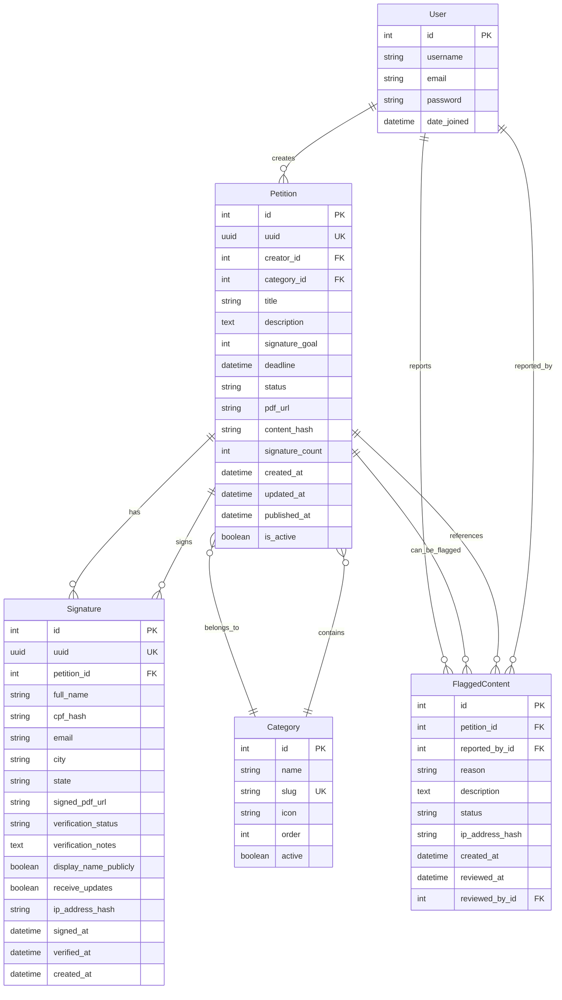

# Petição Brasil - Data Models

**Project Phase:** Planning - Phase 2  
**Document Version:** 1.1  
**Last Updated:** January 22, 2026  
**Status:** Draft  
**Domain:** peticaobrasil.com.br

---

## Table of Contents

1. [Database Schema Overview](#database-schema-overview)
2. [Model Definitions](#model-definitions)
3. [Relationships and Constraints](#relationships-and-constraints)
4. [Indexes and Performance](#indexes-and-performance)
5. [Data Validation Rules](#data-validation-rules)
6. [Migration Strategy](#migration-strategy)
7. [Sample Data](#sample-data)

---

## Database Schema Overview

### Entity Relationship Diagram



---

## Model Definitions

### 1. Category Model

**Purpose:** Categorize petitions by topic/theme

**File:** `democracia_direta/models.py`

```python
from django.db import models
from django.utils.text import slugify


class Category(models.Model):
    """
    Categories for organizing petitions by topic.
    Predefined and managed by administrators.
    """
    
    name = models.CharField(
        max_length=100,
        unique=True,
        verbose_name="Nome",
        help_text="Nome da categoria (ex: Saúde, Educação)"
    )
    
    slug = models.SlugField(
        max_length=100,
        unique=True,
        verbose_name="Slug",
        help_text="URL amigável (gerado automaticamente)"
    )
    
    description = models.TextField(
        blank=True,
        verbose_name="Descrição",
        help_text="Descrição opcional da categoria"
    )
    
    icon = models.CharField(
        max_length=50,
        blank=True,
        verbose_name="Ícone",
        help_text="Nome do ícone Bootstrap ou Font Awesome (ex: 'heart', 'book')"
    )
    
    color = models.CharField(
        max_length=7,
        default="#0066CC",
        verbose_name="Cor",
        help_text="Cor hexadecimal para exibição (ex: #FF5733)"
    )
    
    order = models.PositiveIntegerField(
        default=0,
        verbose_name="Ordem",
        help_text="Ordem de exibição (menor = primeiro)"
    )
    
    active = models.BooleanField(
        default=True,
        verbose_name="Ativa",
        help_text="Se desativada, não aparece para novos petições"
    )
    
    created_at = models.DateTimeField(
        auto_now_add=True,
        verbose_name="Criado em"
    )
    
    updated_at = models.DateTimeField(
        auto_now=True,
        verbose_name="Atualizado em"
    )
    
    class Meta:
        verbose_name = "Categoria"
        verbose_name_plural = "Categorias"
        ordering = ['order', 'name']
        indexes = [
            models.Index(fields=['active', 'order']),
        ]
    
    def __str__(self):
        return self.name
    
    def save(self, *args, **kwargs):
        if not self.slug:
            self.slug = slugify(self.name)
        super().save(*args, **kwargs)
    
    def get_absolute_url(self):
        from django.urls import reverse
        return reverse('petition_category', kwargs={'slug': self.slug})
    
    @property
    def petition_count(self):
        """Count of active petitions in this category"""
        return self.petitions.filter(is_active=True).count()
```

**Fields Explanation:**
- `name` - Display name (e.g., "Saúde", "Educação")
- `slug` - URL-friendly version (e.g., "saude", "educacao")
- `icon` - Icon identifier for UI
- `color` - Brand color for category badge
- `order` - Sort order in category list
- `active` - Enable/disable without deleting

---

### 2. User Model

**Purpose:** User accounts for petition creators and administrators

**Implementation:** Using Django's built-in `django.contrib.auth.User` model

**Note:** For the MVP, we use Django's default User model. If custom fields are needed later, we can migrate to a custom user model.

**File:** Django's `django.contrib.auth.models.User`

**Available Fields:**

```python
from django.contrib.auth.models import User

# User model fields (provided by Django):
# - id (AutoField, primary key)
# - username (CharField, max_length=150, unique)
# - first_name (CharField, max_length=150, blank=True)
# - last_name (CharField, max_length=150, blank=True)
# - email (EmailField, blank=True)
# - password (CharField, max_length=128, hashed)
# - is_staff (BooleanField, default=False)
# - is_active (BooleanField, default=True)
# - is_superuser (BooleanField, default=False)
# - date_joined (DateTimeField, auto_now_add=True)
# - last_login (DateTimeField, null=True, blank=True)

# Relationships created by our models:
# - petitions_created (reverse FK from Petition)
# - reports_made (reverse FK from FlaggedContent)
# - reports_reviewed (reverse FK from FlaggedContent)
```

**Usage in Our Models:**

All models reference users via `settings.AUTH_USER_MODEL`:

```python
from django.conf import settings

class Petition(models.Model):
    creator = models.ForeignKey(
        settings.AUTH_USER_MODEL,  # Points to User model
        on_delete=models.CASCADE,
        related_name='petitions_created'
    )
```

**User Registration & Authentication:**

```python
# Create new user
from django.contrib.auth.models import User

user = User.objects.create_user(
    username='joao_silva',
    email='joao@example.com',
    password='secure_password',
    first_name='João',
    last_name='Silva'
)

# User automatically gets:
# - Hashed password (never stored in plain text)
# - is_active=True (can log in)
# - is_staff=False (not admin)
# - date_joined=now()
```

**User Profile Properties:**

```python
# Add utility methods via User extension (if needed later)
# For now, we can add properties directly in views/templates

def user_petition_count(user):
    """Count of petitions created by user"""
    return user.petitions_created.count()

def user_active_petitions(user):
    """Active petitions created by user"""
    return user.petitions_created.filter(
        status='active',
        is_active=True
    )

def user_total_signatures(user):
    """Total signatures across all user's petitions"""
    from django.db.models import Sum
    return user.petitions_created.aggregate(
        total=Sum('signature_count')
    )['total'] or 0
```

**Future Enhancement: Custom User Model**

If we need additional user fields (e.g., phone number, bio, profile picture), we can create a custom user model:

```python
# Future: petitions/models.py
from django.contrib.auth.models import AbstractUser

class User(AbstractUser):
    """
    Custom user model extending Django's AbstractUser.
    Add custom fields as needed.
    """
    phone = models.CharField(max_length=20, blank=True)
    bio = models.TextField(max_length=500, blank=True)
    profile_picture = models.ImageField(upload_to='profiles/', blank=True)
    verified_email = models.BooleanField(default=False)
    
    class Meta:
        verbose_name = "Usuário"
        verbose_name_plural = "Usuários"

# Then update settings.py:
# AUTH_USER_MODEL = 'petitions.User'
```

**Fields Explanation:**
- `username` - Unique login identifier (required)
- `email` - User's email address (required for password reset)
- `first_name`, `last_name` - Display name components
- `password` - Hashed password (never plain text)
- `is_staff` - Can access Django admin interface
- `is_active` - Account enabled (can be disabled without deletion)
- `is_superuser` - Has all permissions
- `date_joined` - Account creation timestamp

---

### 3. Petition Model

**Purpose:** Core model representing a public petition

**File:** `democracia_direta/models.py`

```python
import uuid
from django.db import models
from django.conf import settings
from django.utils import timezone
from django.core.validators import MinValueValidator, MaxValueValidator
from django.utils.text import slugify


class Petition(models.Model):
    """
    A public petition created by a registered user.
    Can be signed by anyone (no login required to sign).
    """
    
    # Status choices
    STATUS_DRAFT = 'draft'
    STATUS_ACTIVE = 'active'
    STATUS_COMPLETED = 'completed'
    STATUS_EXPIRED = 'expired'
    STATUS_CLOSED = 'closed'
    STATUS_FLAGGED = 'flagged'
    
    STATUS_CHOICES = [
        (STATUS_DRAFT, 'Rascunho'),
        (STATUS_ACTIVE, 'Ativa'),
        (STATUS_COMPLETED, 'Concluída'),
        (STATUS_EXPIRED, 'Expirada'),
        (STATUS_CLOSED, 'Fechada'),
        (STATUS_FLAGGED, 'Sinalizada'),
    ]
    
    # Unique identifier
    uuid = models.UUIDField(
        default=uuid.uuid4,
        editable=False,
        unique=True,
        verbose_name="UUID",
        help_text="Identificador único da petição"
    )
    
    # Creator (authenticated user required)
    creator = models.ForeignKey(
        settings.AUTH_USER_MODEL,
        on_delete=models.CASCADE,
        related_name='petitions_created',
        verbose_name="Criador",
        help_text="Usuário que criou a petição"
    )
    
    # Category
    category = models.ForeignKey(
        'Category',
        on_delete=models.PROTECT,
        related_name='petitions',
        verbose_name="Categoria",
        help_text="Categoria temática da petição"
    )
    
    # Content
    title = models.CharField(
        max_length=200,
        verbose_name="Título",
        help_text="Título da petição (máx. 200 caracteres)"
    )
    
    slug = models.SlugField(
        max_length=220,
        blank=True,
        verbose_name="Slug",
        help_text="URL amigável (gerado automaticamente)"
    )
    
    description = models.TextField(
        max_length=10000,
        verbose_name="Descrição",
        help_text="Descrição completa da causa (máx. 10.000 caracteres)"
    )
    
    # Goals
    signature_goal = models.PositiveIntegerField(
        validators=[MinValueValidator(10), MaxValueValidator(1000000)],
        verbose_name="Meta de assinaturas",
        help_text="Número de assinaturas desejadas (10 a 1.000.000)"
    )
    
    deadline = models.DateField(
        null=True,
        blank=True,
        verbose_name="Prazo",
        help_text="Data limite para coleta de assinaturas (opcional)"
    )
    
    # Status
    status = models.CharField(
        max_length=20,
        choices=STATUS_CHOICES,
        default=STATUS_ACTIVE,
        verbose_name="Status",
        help_text="Status atual da petição"
    )
    
    is_active = models.BooleanField(
        default=True,
        verbose_name="Ativa",
        help_text="Se a petição está aceitando assinaturas"
    )
    
    # PDF and verification
    pdf_url = models.URLField(
        max_length=500,
        blank=True,
        verbose_name="URL do PDF",
        help_text="URL do PDF original da petição"
    )
    
    content_hash = models.CharField(
        max_length=64,
        blank=True,
        verbose_name="Hash do conteúdo",
        help_text="SHA-256 hash do conteúdo da petição para verificação"
    )
    
    # Statistics
    signature_count = models.PositiveIntegerField(
        default=0,
        verbose_name="Assinaturas",
        help_text="Número de assinaturas verificadas"
    )
    
    view_count = models.PositiveIntegerField(
        default=0,
        verbose_name="Visualizações",
        help_text="Número de visualizações da página"
    )
    
    share_count = models.PositiveIntegerField(
        default=0,
        verbose_name="Compartilhamentos",
        help_text="Número de compartilhamentos em redes sociais"
    )
    
    # Timestamps
    created_at = models.DateTimeField(
        auto_now_add=True,
        verbose_name="Criado em"
    )
    
    updated_at = models.DateTimeField(
        auto_now=True,
        verbose_name="Atualizado em"
    )
    
    published_at = models.DateTimeField(
        null=True,
        blank=True,
        verbose_name="Publicado em",
        help_text="Data de publicação da petição"
    )
    
    # Moderation
    moderation_notes = models.TextField(
        blank=True,
        verbose_name="Notas de moderação",
        help_text="Notas internas para moderadores"
    )
    
    class Meta:
        verbose_name = "Petição"
        verbose_name_plural = "Petições"
        ordering = ['-created_at']
        indexes = [
            models.Index(fields=['status', 'is_active', '-created_at']),
            models.Index(fields=['category', '-created_at']),
            models.Index(fields=['creator', '-created_at']),
            models.Index(fields=['-signature_count']),
            models.Index(fields=['uuid']),
        ]
        constraints = [
            models.CheckConstraint(
                check=models.Q(signature_goal__gte=10) & models.Q(signature_goal__lte=1000000),
                name='valid_signature_goal'
            ),
        ]
    
    def __str__(self):
        return self.title
    
    def save(self, *args, **kwargs):
        # Generate slug from title
        if not self.slug:
            base_slug = slugify(self.title)[:200]
            self.slug = base_slug
            
            # Ensure uniqueness
            counter = 1
            while Petition.objects.filter(slug=self.slug).exclude(pk=self.pk).exists():
                self.slug = f"{base_slug}-{counter}"
                counter += 1
        
        # Auto-publish if status is active and not yet published
        if self.status == self.STATUS_ACTIVE and not self.published_at:
            self.published_at = timezone.now()
        
        # Auto-expire if deadline passed
        if self.deadline and self.deadline < timezone.now().date():
            if self.status == self.STATUS_ACTIVE:
                self.status = self.STATUS_EXPIRED
                self.is_active = False
        
        # Auto-complete if goal reached
        if self.signature_count >= self.signature_goal:
            if self.status == self.STATUS_ACTIVE:
                self.status = self.STATUS_COMPLETED
        
        super().save(*args, **kwargs)
    
    def get_absolute_url(self):
        from django.urls import reverse
        return reverse('petition_detail', kwargs={'pk': self.pk, 'slug': self.slug})
    
    @property
    def progress_percentage(self):
        """Calculate percentage of goal reached"""
        if self.signature_goal == 0:
            return 0
        return min(100, int((self.signature_count / self.signature_goal) * 100))
    
    @property
    def days_remaining(self):
        """Calculate days until deadline"""
        if not self.deadline:
            return None
        delta = self.deadline - timezone.now().date()
        return max(0, delta.days)
    
    @property
    def is_expired(self):
        """Check if petition has expired"""
        if not self.deadline:
            return False
        return self.deadline < timezone.now().date()
    
    @property
    def is_successful(self):
        """Check if petition reached its goal"""
        return self.signature_count >= self.signature_goal
    
    def increment_signature_count(self):
        """Safely increment signature count (atomic operation)"""
        self.__class__.objects.filter(pk=self.pk).update(
            signature_count=models.F('signature_count') + 1
        )
        self.refresh_from_db()
    
    def increment_view_count(self):
        """Safely increment view count (atomic operation)"""
        self.__class__.objects.filter(pk=self.pk).update(
            view_count=models.F('view_count') + 1
        )
    
    def increment_share_count(self):
        """Safely increment share count (atomic operation)"""
        self.__class__.objects.filter(pk=self.pk).update(
            share_count=models.F('share_count') + 1
        )
```

**Fields Explanation:**
- `uuid` - Unique identifier embedded in PDF
- `creator` - ForeignKey to User (petition creator)
- `category` - ForeignKey to Category
- `title` - Petition headline (max 200 chars)
- `description` - Full petition text (max 10,000 chars)
- `signature_goal` - Target number of signatures
- `deadline` - Optional expiration date
- `status` - Current state (draft/active/completed/expired/closed/flagged)
- `pdf_url` - S3 URL to original petition PDF
- `content_hash` - SHA-256 for verification
- `signature_count` - Cached count (denormalized for performance)

---

### 4. Signature Model

**Purpose:** Record of a verified signature on a petition

**File:** `democracia_direta/models.py`

```python
import uuid
import hashlib
from django.db import models
from django.core.validators import EmailValidator


class Signature(models.Model):
    """
    A verified signature on a petition.
    Signer does NOT need to be a registered user.
    """
    
    # Verification status choices
    STATUS_PENDING = 'pending'
    STATUS_PROCESSING = 'processing'
    STATUS_APPROVED = 'approved'
    STATUS_REJECTED = 'rejected'
    STATUS_MANUAL_REVIEW = 'manual_review'
    
    STATUS_CHOICES = [
        (STATUS_PENDING, 'Pendente'),
        (STATUS_PROCESSING, 'Processando'),
        (STATUS_APPROVED, 'Aprovada'),
        (STATUS_REJECTED, 'Rejeitada'),
        (STATUS_MANUAL_REVIEW, 'Revisão Manual'),
    ]
    
    # Brazilian states
    STATES = [
        ('AC', 'Acre'), ('AL', 'Alagoas'), ('AP', 'Amapá'),
        ('AM', 'Amazonas'), ('BA', 'Bahia'), ('CE', 'Ceará'),
        ('DF', 'Distrito Federal'), ('ES', 'Espírito Santo'),
        ('GO', 'Goiás'), ('MA', 'Maranhão'), ('MT', 'Mato Grosso'),
        ('MS', 'Mato Grosso do Sul'), ('MG', 'Minas Gerais'),
        ('PA', 'Pará'), ('PB', 'Paraíba'), ('PR', 'Paraná'),
        ('PE', 'Pernambuco'), ('PI', 'Piauí'), ('RJ', 'Rio de Janeiro'),
        ('RN', 'Rio Grande do Norte'), ('RS', 'Rio Grande do Sul'),
        ('RO', 'Rondônia'), ('RR', 'Roraima'), ('SC', 'Santa Catarina'),
        ('SP', 'São Paulo'), ('SE', 'Sergipe'), ('TO', 'Tocantins'),
    ]
    
    # Unique identifier
    uuid = models.UUIDField(
        default=uuid.uuid4,
        editable=False,
        unique=True,
        verbose_name="UUID",
        help_text="Identificador único da assinatura"
    )
    
    # Petition reference
    petition = models.ForeignKey(
        'Petition',
        on_delete=models.CASCADE,
        related_name='signatures',
        verbose_name="Petição",
        help_text="Petição assinada"
    )
    
    # Signer information (from verification form)
    full_name = models.CharField(
        max_length=200,
        verbose_name="Nome completo",
        help_text="Nome completo do signatário"
    )
    
    cpf_hash = models.CharField(
        max_length=64,
        verbose_name="Hash do CPF",
        help_text="Hash SHA-256 do CPF (não armazenamos CPF em texto)"
    )
    
    email = models.EmailField(
        validators=[EmailValidator()],
        verbose_name="Email",
        help_text="Email para confirmação"
    )
    
    city = models.CharField(
        max_length=100,
        verbose_name="Cidade",
        help_text="Cidade do signatário"
    )
    
    state = models.CharField(
        max_length=2,
        choices=STATES,
        verbose_name="Estado",
        help_text="Estado do signatário"
    )
    
    # PDF file
    signed_pdf_url = models.URLField(
        max_length=500,
        blank=True,
        verbose_name="URL do PDF assinado",
        help_text="URL do PDF assinado via Gov.br"
    )
    
    signed_pdf_size = models.PositiveIntegerField(
        null=True,
        blank=True,
        verbose_name="Tamanho do PDF",
        help_text="Tamanho do arquivo em bytes"
    )
    
    # Verification
    verification_status = models.CharField(
        max_length=20,
        choices=STATUS_CHOICES,
        default=STATUS_PENDING,
        verbose_name="Status de verificação",
        help_text="Status da verificação automática"
    )
    
    verification_notes = models.TextField(
        blank=True,
        verbose_name="Notas de verificação",
        help_text="Detalhes do processo de verificação"
    )
    
    verified_cpf_from_certificate = models.BooleanField(
        default=False,
        verbose_name="CPF verificado do certificado",
        help_text="Se o CPF foi extraído e validado do certificado digital"
    )
    
    certificate_info = models.JSONField(
        null=True,
        blank=True,
        verbose_name="Informações do certificado",
        help_text="Dados extraídos do certificado digital (JSON)"
    )
    
    # Privacy settings
    display_name_publicly = models.BooleanField(
        default=False,
        verbose_name="Exibir nome publicamente",
        help_text="Se True, exibe nome completo. Se False, apenas iniciais."
    )
    
    receive_updates = models.BooleanField(
        default=False,
        verbose_name="Receber atualizações",
        help_text="Aceita receber emails sobre o progresso da petição"
    )
    
    # Security and audit
    ip_address_hash = models.CharField(
        max_length=64,
        blank=True,
        verbose_name="Hash do IP",
        help_text="Hash SHA-256 do endereço IP (para auditoria)"
    )
    
    user_agent = models.CharField(
        max_length=500,
        blank=True,
        verbose_name="User Agent",
        help_text="Informações do navegador (para detecção de fraude)"
    )
    
    # Timestamps
    created_at = models.DateTimeField(
        auto_now_add=True,
        verbose_name="Criado em",
        help_text="Quando a assinatura foi enviada"
    )
    
    signed_at = models.DateTimeField(
        null=True,
        blank=True,
        verbose_name="Assinado em",
        help_text="Data/hora extraída do certificado digital"
    )
    
    verified_at = models.DateTimeField(
        null=True,
        blank=True,
        verbose_name="Verificado em",
        help_text="Quando a verificação foi concluída"
    )
    
    class Meta:
        verbose_name = "Assinatura"
        verbose_name_plural = "Assinaturas"
        ordering = ['-created_at']
        indexes = [
            models.Index(fields=['petition', 'verification_status', '-created_at']),
            models.Index(fields=['verification_status', '-created_at']),
            models.Index(fields=['cpf_hash', 'petition']),  # Duplicate detection
            models.Index(fields=['email']),
        ]
        constraints = [
            # Ensure one signature per CPF per petition
            models.UniqueConstraint(
                fields=['petition', 'cpf_hash'],
                name='unique_cpf_per_petition'
            ),
        ]
    
    def __str__(self):
        return f"{self.full_name} - {self.petition.title}"
    
    @staticmethod
    def hash_cpf(cpf):
        """Hash a CPF for secure storage"""
        # Remove formatting
        cpf_clean = ''.join(filter(str.isdigit, cpf))
        # Hash with SHA-256
        return hashlib.sha256(cpf_clean.encode()).hexdigest()
    
    @staticmethod
    def hash_ip(ip_address):
        """Hash an IP address for secure storage"""
        return hashlib.sha256(ip_address.encode()).hexdigest()
    
    @property
    def display_name(self):
        """Return name for public display based on privacy setting"""
        if self.display_name_publicly:
            return self.full_name
        else:
            # Return initials (e.g., "João Silva" -> "J. S.")
            parts = self.full_name.split()
            if len(parts) == 1:
                return f"{parts[0][0]}."
            return f"{parts[0][0]}. {parts[-1][0]}."
    
    @property
    def is_verified(self):
        """Check if signature is verified"""
        return self.verification_status == self.STATUS_APPROVED
    
    def approve(self):
        """Approve signature and increment petition count"""
        if self.verification_status != self.STATUS_APPROVED:
            self.verification_status = self.STATUS_APPROVED
            self.verified_at = timezone.now()
            self.save()
            
            # Increment petition signature count
            self.petition.increment_signature_count()
    
    def reject(self, reason):
        """Reject signature with reason"""
        self.verification_status = self.STATUS_REJECTED
        self.verification_notes = reason
        self.save()
```

**Fields Explanation:**
- `uuid` - Unique signature identifier
- `petition` - ForeignKey to Petition
- `full_name` - Signer's full name (from form)
- `cpf_hash` - SHA-256 hash of CPF (never store plain CPF)
- `email` - For confirmation emails
- `city`, `state` - Geographic info
- `signed_pdf_url` - S3 URL to signed PDF
- `verification_status` - pending/processing/approved/rejected/manual_review
- `certificate_info` - JSON with certificate data
- `display_name_publicly` - Privacy setting
- `ip_address_hash` - Hashed IP for fraud detection

---

### 5. FlaggedContent Model

**Purpose:** Track reported petitions for moderation

**File:** `democracia_direta/models.py`

```python
from django.db import models
from django.conf import settings


class FlaggedContent(models.Model):
    """
    Reports of inappropriate or problematic petitions.
    Submitted by visitors (with or without login).
    """
    
    # Report reasons
    REASON_SPAM = 'spam'
    REASON_HATE = 'hate'
    REASON_MISINFO = 'misinfo'
    REASON_OFFTOPIC = 'offtopic'
    REASON_DUPLICATE = 'duplicate'
    REASON_OTHER = 'other'
    
    REASON_CHOICES = [
        (REASON_SPAM, 'Spam'),
        (REASON_HATE, 'Discurso de ódio'),
        (REASON_MISINFO, 'Desinformação'),
        (REASON_OFFTOPIC, 'Fora do tema'),
        (REASON_DUPLICATE, 'Duplicada'),
        (REASON_OTHER, 'Outro'),
    ]
    
    # Moderation status
    STATUS_PENDING = 'pending'
    STATUS_REVIEWING = 'reviewing'
    STATUS_APPROVED = 'approved'  # Report valid, action taken
    STATUS_DISMISSED = 'dismissed'  # Report invalid
    
    STATUS_CHOICES = [
        (STATUS_PENDING, 'Pendente'),
        (STATUS_REVIEWING, 'Em análise'),
        (STATUS_APPROVED, 'Procedente'),
        (STATUS_DISMISSED, 'Improcedente'),
    ]
    
    # Reported content
    petition = models.ForeignKey(
        'Petition',
        on_delete=models.CASCADE,
        related_name='flags',
        verbose_name="Petição",
        help_text="Petição denunciada"
    )
    
    # Reporter (optional - can be anonymous)
    reported_by = models.ForeignKey(
        settings.AUTH_USER_MODEL,
        on_delete=models.SET_NULL,
        null=True,
        blank=True,
        related_name='reports_made',
        verbose_name="Denunciado por",
        help_text="Usuário que fez a denúncia (se logado)"
    )
    
    reporter_email = models.EmailField(
        blank=True,
        verbose_name="Email do denunciante",
        help_text="Email para contato (opcional)"
    )
    
    # Report details
    reason = models.CharField(
        max_length=20,
        choices=REASON_CHOICES,
        verbose_name="Motivo",
        help_text="Motivo da denúncia"
    )
    
    description = models.TextField(
        max_length=1000,
        blank=True,
        verbose_name="Descrição",
        help_text="Detalhes adicionais sobre a denúncia"
    )
    
    # Moderation
    status = models.CharField(
        max_length=20,
        choices=STATUS_CHOICES,
        default=STATUS_PENDING,
        verbose_name="Status",
        help_text="Status da análise"
    )
    
    reviewed_by = models.ForeignKey(
        settings.AUTH_USER_MODEL,
        on_delete=models.SET_NULL,
        null=True,
        blank=True,
        related_name='reports_reviewed',
        verbose_name="Analisado por",
        help_text="Moderador que analisou a denúncia"
    )
    
    review_notes = models.TextField(
        blank=True,
        verbose_name="Notas da análise",
        help_text="Notas do moderador sobre a análise"
    )
    
    action_taken = models.CharField(
        max_length=200,
        blank=True,
        verbose_name="Ação tomada",
        help_text="Ação realizada pelo moderador"
    )
    
    # Security
    ip_address_hash = models.CharField(
        max_length=64,
        blank=True,
        verbose_name="Hash do IP",
        help_text="Hash SHA-256 do endereço IP do denunciante"
    )
    
    # Timestamps
    created_at = models.DateTimeField(
        auto_now_add=True,
        verbose_name="Criado em"
    )
    
    reviewed_at = models.DateTimeField(
        null=True,
        blank=True,
        verbose_name="Analisado em"
    )
    
    class Meta:
        verbose_name = "Conteúdo denunciado"
        verbose_name_plural = "Conteúdos denunciados"
        ordering = ['-created_at']
        indexes = [
            models.Index(fields=['petition', 'status', '-created_at']),
            models.Index(fields=['status', '-created_at']),
        ]
    
    def __str__(self):
        return f"Denúncia: {self.petition.title} ({self.get_reason_display()})"
    
    @property
    def is_pending(self):
        return self.status == self.STATUS_PENDING
    
    def approve(self, moderator, action, notes=''):
        """Approve report and take action"""
        self.status = self.STATUS_APPROVED
        self.reviewed_by = moderator
        self.reviewed_at = timezone.now()
        self.action_taken = action
        self.review_notes = notes
        self.save()
    
    def dismiss(self, moderator, notes=''):
        """Dismiss report as invalid"""
        self.status = self.STATUS_DISMISSED
        self.reviewed_by = moderator
        self.reviewed_at = timezone.now()
        self.review_notes = notes
        self.save()
```

**Fields Explanation:**
- `petition` - ForeignKey to reported petition
- `reported_by` - Optional ForeignKey to User (if logged in)
- `reporter_email` - Optional email for anonymous reports
- `reason` - Categorized reason for report
- `description` - Free-text details
- `status` - pending/reviewing/approved/dismissed
- `reviewed_by` - Moderator who handled the report
- `action_taken` - What was done (e.g., "Petition hidden", "No action")

---

## Relationships and Constraints

### Foreign Key Relationships

```python
# One-to-Many Relationships

User (1) → Petition (N)
  - One user can create many petitions
  - If user is deleted, petitions are deleted (CASCADE)

Category (1) → Petition (N)
  - One category contains many petitions
  - If category is deleted, prevent deletion (PROTECT)

Petition (1) → Signature (N)
  - One petition has many signatures
  - If petition is deleted, signatures are deleted (CASCADE)

Petition (1) → FlaggedContent (N)
  - One petition can be flagged multiple times
  - If petition is deleted, flags are deleted (CASCADE)

User (1) → FlaggedContent (N)
  - One user can make many reports
  - If user is deleted, set reported_by to NULL (SET_NULL)
```

### Unique Constraints

```python
# Ensure uniqueness

Category.slug - UNIQUE
  - Prevents duplicate category URLs

Petition.uuid - UNIQUE
  - Ensures unique petition identifier

Signature.uuid - UNIQUE
  - Ensures unique signature identifier

(Signature.petition, Signature.cpf_hash) - UNIQUE TOGETHER
  - Prevents same person signing petition twice
  - One CPF per petition maximum
```

### Check Constraints

```python
# Data integrity constraints

Petition.signature_goal - CHECK (value >= 10 AND value <= 1000000)
  - Signature goal must be between 10 and 1 million

# Additional validation in model clean() methods:
# - deadline must be future date (at creation)
# - deadline must be at least 7 days from creation
# - deadline cannot be more than 1 year from creation
```

---

## Indexes and Performance

### Database Indexes

```python
# Category indexes
Index(fields=['active', 'order'])
  - Fast filtering of active categories in correct order

# Petition indexes
Index(fields=['status', 'is_active', '-created_at'])
  - Fast petition list filtering (most common query)

Index(fields=['category', '-created_at'])
  - Fast category page queries

Index(fields=['creator', '-created_at'])
  - Fast "my petitions" queries

Index(fields=['-signature_count'])
  - Fast sorting by popularity

Index(fields=['uuid'])
  - Fast UUID lookups for verification

# Signature indexes
Index(fields=['petition', 'verification_status', '-created_at'])
  - Fast petition signature list queries

Index(fields=['verification_status', '-created_at'])
  - Fast admin moderation queue

Index(fields=['cpf_hash', 'petition'])
  - Fast duplicate detection

Index(fields=['email'])
  - Fast email lookup for notifications

# FlaggedContent indexes
Index(fields=['petition', 'status', '-created_at'])
  - Fast petition flag lookup

Index(fields=['status', '-created_at'])
  - Fast moderation queue
```

### Query Optimization

```python
# Use select_related for foreign keys (avoid N+1 queries)

# Petition list view
petitions = Petition.objects.select_related('creator', 'category').all()

# Signature list
signatures = Signature.objects.select_related('petition').all()

# Use prefetch_related for reverse foreign keys

# Petition with recent signatures
petition = Petition.objects.prefetch_related(
    Prefetch('signatures',
             queryset=Signature.objects.filter(
                 verification_status='approved'
             ).order_by('-created_at')[:10])
).get(pk=1)

# Use only() to fetch specific fields

# Petition list (don't need full description)
petitions = Petition.objects.only(
    'id', 'title', 'signature_count', 'signature_goal', 
    'status', 'created_at'
).select_related('category')

# Use count() with filters (not len())

# Efficient counting
approved_count = petition.signatures.filter(
    verification_status='approved'
).count()

# NOT: len(petition.signatures.all())  # Loads all records!
```

### Caching Strategy

```python
# Cache expensive queries with Django cache framework

from django.core.cache import cache
from django.db.models import Count, Sum

# Cache category counts (15 minutes)
def get_category_stats():
    cache_key = 'category_stats'
    stats = cache.get(cache_key)
    
    if stats is None:
        stats = Category.objects.filter(active=True).annotate(
            petition_count=Count('petitions', 
                                filter=Q(petitions__is_active=True)),
            total_signatures=Sum('petitions__signature_count')
        ).values('id', 'name', 'petition_count', 'total_signatures')
        
        cache.set(cache_key, list(stats), 60 * 15)  # 15 min
    
    return stats

# Invalidate cache when petition created/signature added
from django.db.models.signals import post_save
from django.dispatch import receiver

@receiver(post_save, sender=Petition)
def invalidate_category_cache(sender, instance, **kwargs):
    cache.delete('category_stats')
```

---

## Data Validation Rules

### Category Validation

```python
from django.core.exceptions import ValidationError

class Category(models.Model):
    # ... fields ...
    
    def clean(self):
        # Validate color is valid hex
        if self.color and not self.color.startswith('#'):
            raise ValidationError({'color': 'Cor deve começar com #'})
        
        if self.color and len(self.color) != 7:
            raise ValidationError({'color': 'Cor deve ter 7 caracteres (#RRGGBB)'})
        
        # Validate icon name (alphanumeric and hyphens only)
        if self.icon and not self.icon.replace('-', '').isalnum():
            raise ValidationError({'icon': 'Ícone deve conter apenas letras, números e hífens'})
```

### Petition Validation

```python
from django.utils import timezone
from datetime import timedelta

class Petition(models.Model):
    # ... fields ...
    
    def clean(self):
        # Validate deadline is in the future
        if self.deadline:
            if self.deadline <= timezone.now().date():
                raise ValidationError({
                    'deadline': 'Prazo deve ser uma data futura'
                })
            
            # Minimum 7 days
            min_deadline = timezone.now().date() + timedelta(days=7)
            if self.deadline < min_deadline:
                raise ValidationError({
                    'deadline': 'Prazo deve ser de pelo menos 7 dias'
                })
            
            # Maximum 1 year
            max_deadline = timezone.now().date() + timedelta(days=365)
            if self.deadline > max_deadline:
                raise ValidationError({
                    'deadline': 'Prazo não pode exceder 1 ano'
                })
        
        # Validate title is not empty or just whitespace
        if not self.title or not self.title.strip():
            raise ValidationError({'title': 'Título não pode estar vazio'})
        
        # Validate description has minimum length
        if len(self.description.strip()) < 100:
            raise ValidationError({
                'description': 'Descrição deve ter pelo menos 100 caracteres'
            })
```

### Signature Validation

```python
class Signature(models.Model):
    # ... fields ...
    
    def clean(self):
        from .utils.validators import validate_cpf
        
        # Validate petition is active
        if not self.petition.is_active:
            raise ValidationError('Esta petição não está mais aceitando assinaturas')
        
        # Note: CPF validation happens in form before hashing
        # Here we just check hash exists
        if not self.cpf_hash:
            raise ValidationError('CPF é obrigatório')
        
        # Validate email
        if not self.email or '@' not in self.email:
            raise ValidationError({'email': 'Email inválido'})
        
        # Validate state
        valid_states = [code for code, name in self.STATES]
        if self.state not in valid_states:
            raise ValidationError({'state': 'Estado inválido'})
```

### Custom Validators

```python
# democracia_direta/utils/validators.py

def validate_cpf(cpf):
    """
    Validate Brazilian CPF number.
    Uses validate-docbr library.
    """
    from validate_docbr import CPF
    
    validator = CPF()
    
    # Remove formatting
    cpf_clean = ''.join(filter(str.isdigit, cpf))
    
    if not validator.validate(cpf_clean):
        raise ValidationError('CPF inválido')
    
    return cpf_clean


def validate_pdf_file(file):
    """
    Validate uploaded file is a PDF.
    Checks magic bytes, not just extension.
    """
    # Check file size (max 10MB)
    if file.size > 10 * 1024 * 1024:
        raise ValidationError('Arquivo muito grande (máx. 10MB)')
    
    # Check magic bytes (PDF starts with %PDF)
    file.seek(0)
    header = file.read(4)
    file.seek(0)
    
    if header != b'%PDF':
        raise ValidationError('Arquivo não é um PDF válido')
    
    return file


def sanitize_filename(filename):
    """
    Sanitize uploaded filename to prevent path traversal.
    """
    import os
    import re
    
    # Get just the basename (remove any path)
    filename = os.path.basename(filename)
    
    # Remove non-alphanumeric characters (except dots and hyphens)
    filename = re.sub(r'[^\w\s.-]', '', filename)
    
    # Replace spaces with hyphens
    filename = filename.replace(' ', '-')
    
    # Remove multiple consecutive dots
    filename = re.sub(r'\.+', '.', filename)
    
    # Ensure .pdf extension
    if not filename.lower().endswith('.pdf'):
        filename += '.pdf'
    
    return filename
```

---

## Migration Strategy

### Initial Migration

```python
# Generated by Django - will create all tables

# democracia_direta/migrations/0001_initial.py

from django.db import migrations, models
import django.db.models.deletion
import uuid

class Migration(migrations.Migration):

    initial = True

    dependencies = [
        ('auth', '0012_alter_user_first_name_max_length'),
    ]

    operations = [
        # Create Category table
        migrations.CreateModel(
            name='Category',
            fields=[
                ('id', models.BigAutoField(auto_created=True, primary_key=True)),
                ('name', models.CharField(max_length=100, unique=True)),
                ('slug', models.SlugField(max_length=100, unique=True)),
                ('description', models.TextField(blank=True)),
                ('icon', models.CharField(blank=True, max_length=50)),
                ('color', models.CharField(default='#0066CC', max_length=7)),
                ('order', models.PositiveIntegerField(default=0)),
                ('active', models.BooleanField(default=True)),
                ('created_at', models.DateTimeField(auto_now_add=True)),
                ('updated_at', models.DateTimeField(auto_now=True)),
            ],
            options={
                'verbose_name': 'Categoria',
                'verbose_name_plural': 'Categorias',
                'ordering': ['order', 'name'],
            },
        ),
        
        # Create Petition table
        migrations.CreateModel(
            name='Petition',
            fields=[
                ('id', models.BigAutoField(auto_created=True, primary_key=True)),
                ('uuid', models.UUIDField(default=uuid.uuid4, editable=False, unique=True)),
                ('title', models.CharField(max_length=200)),
                ('slug', models.SlugField(blank=True, max_length=220)),
                ('description', models.TextField(max_length=10000)),
                ('signature_goal', models.PositiveIntegerField()),
                ('deadline', models.DateField(blank=True, null=True)),
                ('status', models.CharField(choices=[...], default='active', max_length=20)),
                ('is_active', models.BooleanField(default=True)),
                ('pdf_url', models.URLField(blank=True, max_length=500)),
                ('content_hash', models.CharField(blank=True, max_length=64)),
                ('signature_count', models.PositiveIntegerField(default=0)),
                ('view_count', models.PositiveIntegerField(default=0)),
                ('share_count', models.PositiveIntegerField(default=0)),
                ('created_at', models.DateTimeField(auto_now_add=True)),
                ('updated_at', models.DateTimeField(auto_now=True)),
                ('published_at', models.DateTimeField(blank=True, null=True)),
                ('moderation_notes', models.TextField(blank=True)),
                ('category', models.ForeignKey(on_delete=django.db.models.deletion.PROTECT, related_name='petitions', to='democracia_direta.category')),
                ('creator', models.ForeignKey(on_delete=django.db.models.deletion.CASCADE, related_name='petitions_created', to='auth.user')),
            ],
            options={
                'verbose_name': 'Petição',
                'verbose_name_plural': 'Petições',
                'ordering': ['-created_at'],
            },
        ),
        
        # Create Signature table
        migrations.CreateModel(
            name='Signature',
            fields=[
                ('id', models.BigAutoField(auto_created=True, primary_key=True)),
                ('uuid', models.UUIDField(default=uuid.uuid4, editable=False, unique=True)),
                ('full_name', models.CharField(max_length=200)),
                ('cpf_hash', models.CharField(max_length=64)),
                ('email', models.EmailField()),
                ('city', models.CharField(max_length=100)),
                ('state', models.CharField(choices=[...], max_length=2)),
                ('signed_pdf_url', models.URLField(blank=True, max_length=500)),
                ('signed_pdf_size', models.PositiveIntegerField(blank=True, null=True)),
                ('verification_status', models.CharField(choices=[...], default='pending', max_length=20)),
                ('verification_notes', models.TextField(blank=True)),
                ('verified_cpf_from_certificate', models.BooleanField(default=False)),
                ('certificate_info', models.JSONField(blank=True, null=True)),
                ('display_name_publicly', models.BooleanField(default=False)),
                ('receive_updates', models.BooleanField(default=False)),
                ('ip_address_hash', models.CharField(blank=True, max_length=64)),
                ('user_agent', models.CharField(blank=True, max_length=500)),
                ('created_at', models.DateTimeField(auto_now_add=True)),
                ('signed_at', models.DateTimeField(blank=True, null=True)),
                ('verified_at', models.DateTimeField(blank=True, null=True)),
                ('petition', models.ForeignKey(on_delete=django.db.models.deletion.CASCADE, related_name='signatures', to='democracia_direta.petition')),
            ],
            options={
                'verbose_name': 'Assinatura',
                'verbose_name_plural': 'Assinaturas',
                'ordering': ['-created_at'],
            },
        ),
        
        # Create FlaggedContent table
        migrations.CreateModel(
            name='FlaggedContent',
            fields=[
                ('id', models.BigAutoField(auto_created=True, primary_key=True)),
                ('reporter_email', models.EmailField(blank=True)),
                ('reason', models.CharField(choices=[...], max_length=20)),
                ('description', models.TextField(blank=True, max_length=1000)),
                ('status', models.CharField(choices=[...], default='pending', max_length=20)),
                ('review_notes', models.TextField(blank=True)),
                ('action_taken', models.CharField(blank=True, max_length=200)),
                ('ip_address_hash', models.CharField(blank=True, max_length=64)),
                ('created_at', models.DateTimeField(auto_now_add=True)),
                ('reviewed_at', models.DateTimeField(blank=True, null=True)),
                ('petition', models.ForeignKey(on_delete=django.db.models.deletion.CASCADE, related_name='flags', to='democracia_direta.petition')),
                ('reported_by', models.ForeignKey(blank=True, null=True, on_delete=django.db.models.deletion.SET_NULL, related_name='reports_made', to='auth.user')),
                ('reviewed_by', models.ForeignKey(blank=True, null=True, on_delete=django.db.models.deletion.SET_NULL, related_name='reports_reviewed', to='auth.user')),
            ],
            options={
                'verbose_name': 'Conteúdo denunciado',
                'verbose_name_plural': 'Conteúdos denunciados',
                'ordering': ['-created_at'],
            },
        ),
        
        # Add indexes
        migrations.AddIndex(
            model_name='category',
            index=models.Index(fields=['active', 'order'], name='democracia__active_idx'),
        ),
        migrations.AddIndex(
            model_name='petition',
            index=models.Index(fields=['status', 'is_active', '-created_at'], name='democracia__status_idx'),
        ),
        # ... more indexes ...
        
        # Add constraints
        migrations.AddConstraint(
            model_name='signature',
            constraint=models.UniqueConstraint(fields=['petition', 'cpf_hash'], name='unique_cpf_per_petition'),
        ),
        migrations.AddConstraint(
            model_name='petition',
            constraint=models.CheckConstraint(check=models.Q(('signature_goal__gte', 10), ('signature_goal__lte', 1000000)), name='valid_signature_goal'),
        ),
    ]
```

### Data Fixtures (Initial Categories)

```python
# democracia_direta/fixtures/initial_categories.json

[
    {
        "model": "democracia_direta.category",
        "pk": 1,
        "fields": {
            "name": "Saúde",
            "slug": "saude",
            "description": "Petições relacionadas a saúde pública, hospitais, medicamentos",
            "icon": "heart-pulse",
            "color": "#DC3545",
            "order": 1,
            "active": true
        }
    },
    {
        "model": "democracia_direta.category",
        "pk": 2,
        "fields": {
            "name": "Educação",
            "slug": "educacao",
            "description": "Petições sobre escolas, universidades, ensino",
            "icon": "book",
            "color": "#0D6EFD",
            "order": 2,
            "active": true
        }
    },
    {
        "model": "democracia_direta.category",
        "pk": 3,
        "fields": {
            "name": "Meio Ambiente",
            "slug": "meio-ambiente",
            "description": "Questões ambientais, preservação, sustentabilidade",
            "icon": "tree",
            "color": "#198754",
            "order": 3,
            "active": true
        }
    },
    {
        "model": "democracia_direta.category",
        "pk": 4,
        "fields": {
            "name": "Infraestrutura",
            "slug": "infraestrutura",
            "description": "Transporte, saneamento, obras públicas",
            "icon": "building",
            "color": "#6C757D",
            "order": 4,
            "active": true
        }
    },
    {
        "model": "democracia_direta.category",
        "pk": 5,
        "fields": {
            "name": "Segurança",
            "slug": "seguranca",
            "description": "Segurança pública, policiamento, justiça",
            "icon": "shield",
            "color": "#FFC107",
            "order": 5,
            "active": true
        }
    },
    {
        "model": "democracia_direta.category",
        "pk": 6,
        "fields": {
            "name": "Direitos Humanos",
            "slug": "direitos-humanos",
            "description": "Igualdade, direitos civis, inclusão",
            "icon": "people",
            "color": "#D63384",
            "order": 6,
            "active": true
        }
    },
    {
        "model": "democracia_direta.category",
        "pk": 7,
        "fields": {
            "name": "Economia",
            "slug": "economia",
            "description": "Emprego, impostos, desenvolvimento econômico",
            "icon": "currency-dollar",
            "color": "#20C997",
            "order": 7,
            "active": true
        }
    },
    {
        "model": "democracia_direta.category",
        "pk": 8,
        "fields": {
            "name": "Cultura",
            "slug": "cultura",
            "description": "Arte, patrimônio, eventos culturais",
            "icon": "palette",
            "color": "#6F42C1",
            "order": 8,
            "active": true
        }
    },
    {
        "model": "democracia_direta.category",
        "pk": 9,
        "fields": {
            "name": "Tecnologia",
            "slug": "tecnologia",
            "description": "Inovação, internet, tecnologia digital",
            "icon": "laptop",
            "color": "#0DCAF0",
            "order": 9,
            "active": true
        }
    },
    {
        "model": "democracia_direta.category",
        "pk": 10,
        "fields": {
            "name": "Outros",
            "slug": "outros",
            "description": "Outras causas não categorizadas",
            "icon": "three-dots",
            "color": "#ADB5BD",
            "order": 10,
            "active": true
        }
    }
]
```

### Management Command to Load Categories

```python
# democracia_direta/management/commands/load_petition_categories.py

from django.core.management.base import BaseCommand
from democracia_direta.models import Category


class Command(BaseCommand):
    help = 'Load initial petition categories'

    def handle(self, *args, **options):
        categories = [
            {"name": "Saúde", "icon": "heart-pulse", "color": "#DC3545", "order": 1},
            {"name": "Educação", "icon": "book", "color": "#0D6EFD", "order": 2},
            {"name": "Meio Ambiente", "icon": "tree", "color": "#198754", "order": 3},
            {"name": "Infraestrutura", "icon": "building", "color": "#6C757D", "order": 4},
            {"name": "Segurança", "icon": "shield", "color": "#FFC107", "order": 5},
            {"name": "Direitos Humanos", "icon": "people", "color": "#D63384", "order": 6},
            {"name": "Economia", "icon": "currency-dollar", "color": "#20C997", "order": 7},
            {"name": "Cultura", "icon": "palette", "color": "#6F42C1", "order": 8},
            {"name": "Tecnologia", "icon": "laptop", "color": "#0DCAF0", "order": 9},
            {"name": "Outros", "icon": "three-dots", "color": "#ADB5BD", "order": 10},
        ]
        
        for cat_data in categories:
            category, created = Category.objects.get_or_create(
                name=cat_data['name'],
                defaults=cat_data
            )
            if created:
                self.stdout.write(
                    self.style.SUCCESS(f'Created category: {category.name}')
                )
            else:
                self.stdout.write(
                    self.style.WARNING(f'Category already exists: {category.name}')
                )
        
        self.stdout.write(self.style.SUCCESS('Categories loaded successfully!'))
```

---

## Sample Data

### Example Petition Creation

```python
from django.contrib.auth.models import User
from democracia_direta.models import Category, Petition
from datetime import date, timedelta

# Get or create user
user = User.objects.get(username='admin')

# Get category
category = Category.objects.get(slug='saude')

# Create petition
petition = Petition.objects.create(
    creator=user,
    category=category,
    title="Melhoria do atendimento no Hospital Municipal",
    description="""
    Solicitamos melhorias urgentes no Hospital Municipal de Nossa Cidade.
    
    Os problemas identificados incluem:
    - Longas filas de espera (mais de 5 horas)
    - Falta de medicamentos básicos
    - Equipamentos médicos obsoletos
    - Infraestrutura precária
    
    Propomos as seguintes ações:
    1. Contratação de mais médicos e enfermeiros
    2. Reforma das instalações
    3. Aquisição de novos equipamentos
    4. Melhor gestão da fila de atendimento
    
    O Hospital Municipal atende mais de 10.000 pessoas por mês e merece
    condições dignas de funcionamento.
    """,
    signature_goal=5000,
    deadline=date.today() + timedelta(days=90),
    status=Petition.STATUS_ACTIVE,
    is_active=True,
)

print(f"Created petition: {petition.title}")
print(f"UUID: {petition.uuid}")
print(f"URL: {petition.get_absolute_url()}")
```

### Example Signature Creation

```python
from democracia_direta.models import Signature
from datetime import datetime

signature = Signature.objects.create(
    petition=petition,
    full_name="Maria Silva Santos",
    cpf_hash=Signature.hash_cpf("123.456.789-00"),
    email="maria@example.com",
    city="São Paulo",
    state="SP",
    verification_status=Signature.STATUS_APPROVED,
    display_name_publicly=True,
    receive_updates=True,
    verified_at=datetime.now(),
)

print(f"Created signature: {signature.full_name}")
print(f"Display name: {signature.display_name}")
```

---

## Next Steps

1. ✅ Complete data models documentation
2. ⏭️ Proceed to Phase 3: PDF Generation and Signing
3. ⏭️ Review model definitions for any adjustments
4. ⏭️ Plan model tests (test_models.py)
5. ⏭️ Design admin interface customizations

---

**Document Status:** Complete. Ready for review and implementation.
